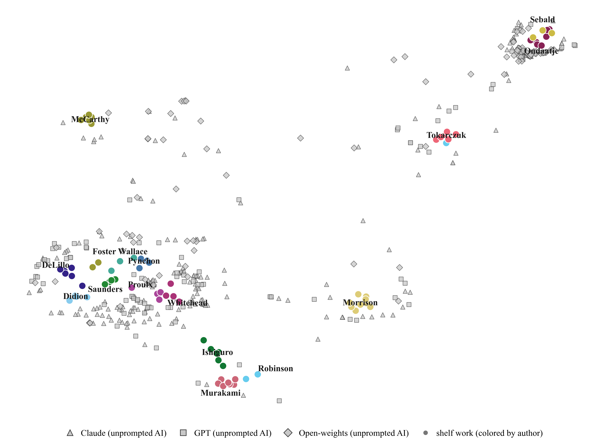
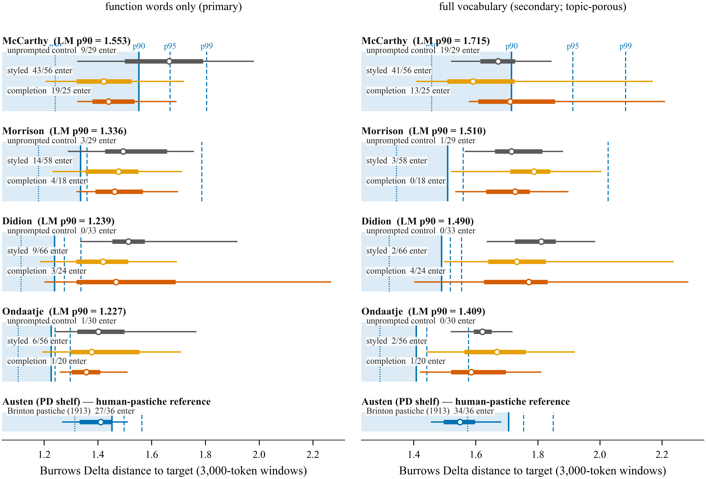
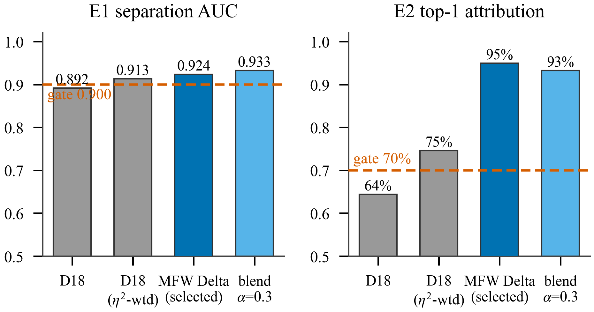
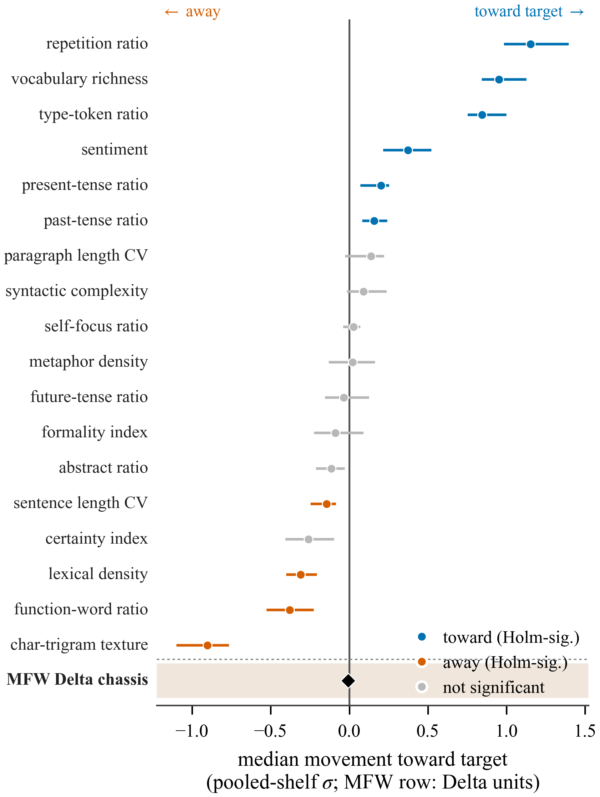
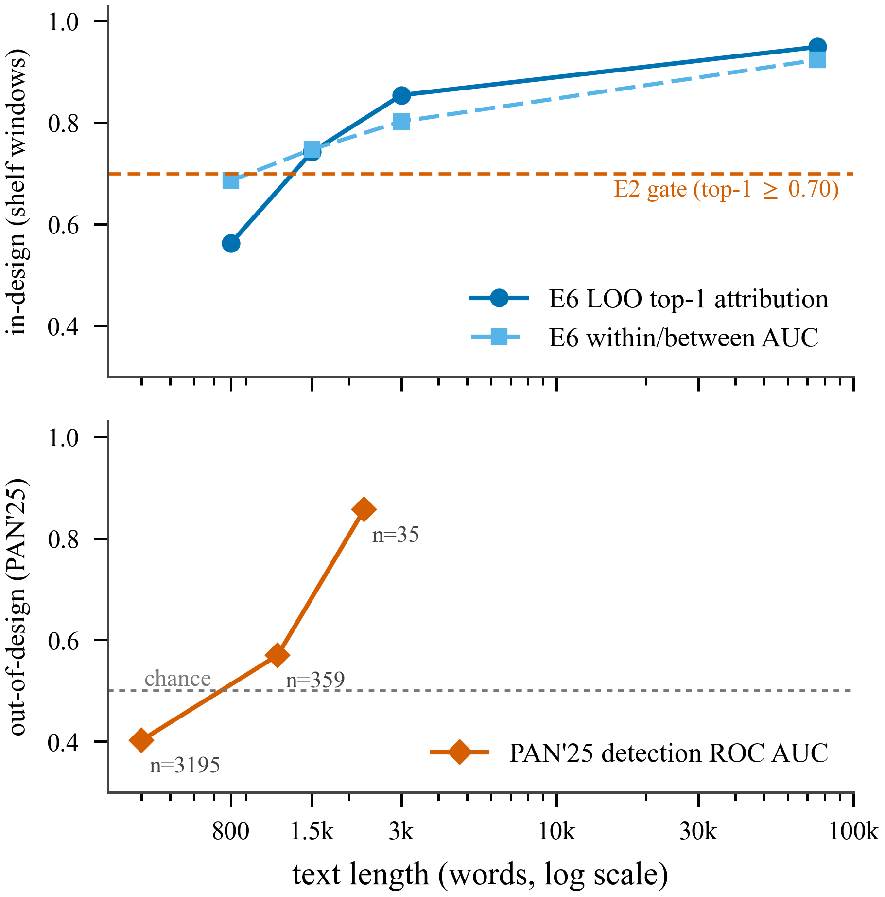
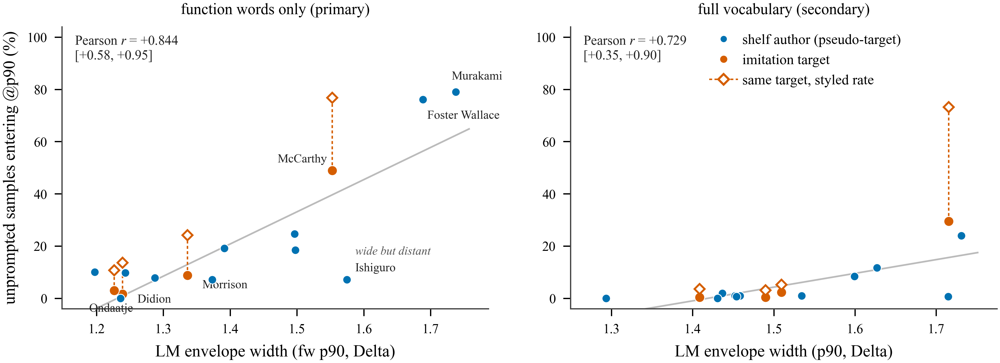
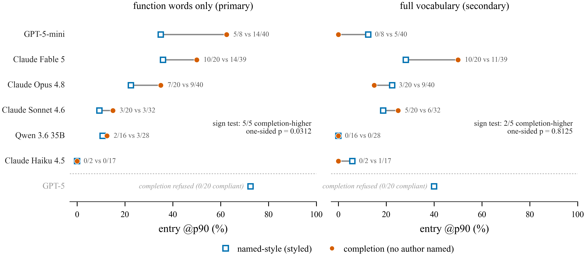

# The Width of a Voice: Placing Machine Imitation Inside Authors' Own Variation

<!-- alt title: "Entering the Envelope: Length-Matched Measurement of Machine Imitation Against Authors' Own Variation" -->

**Will Bryant** — Independent Researcher · wcbryant@gmail.com · ORCID [0009-0009-9350-5916](https://orcid.org/0009-0009-9350-5916)
(sole author; built in sustained human-AI collaboration with Claude — see Disclosure, §8.11)

**Preprint.** This version is released under a **CC BY 4.0** license. Targeting CHR 2027 (Computational Humanities Research).

**Draft v0.5.4 — 2026-07-10.** Cross-target entry matrix added — the §8.12 discriminant-validity control, run on this paper's own styled corpus at the entry level; verdict: the §5.2 increment is substantially target-specific (§5.2 pointer, §8.12 resolution with its qualifications stated in full, one abstract clause). Related-work additions: StoryScope and Frankentexts (§2.2), POLARIS (§2.5), and a verification-lineage positioning paragraph (§2.4). Incidental-echo disclosure promoted into the paper (§8.14) with its echo-excluded robustness check. §5.8 checklist-vs-stylometry scope guard. All previously frozen numbers unchanged; the only new numbers are the cross-target matrix analysis and the echo robustness check.

**Evidence files:** entry, completion, and width numbers trace to `reports/validation/author_space/results2/` — `controls_results.md`, `r3_floor_compliant.md`, `e8_yardstick.md`, `entry_report.md`, `entry_results.json`, `completion_results.md` (2026-06-11), `cross_target_matrix.md`/`.json`, and `echo_robustness.md` (2026-07-10) — and `wave2/e8_results.md`; instrument-validation numbers remain locked to Number Freeze v2 (`wave2/PRIMARY_ARTIFACT.md`); review reports and the remediation plan are committed at `redteam_stats_attack_v03.md`, `redteam_claims_attack_v03.md`, and `RED_TEAM_SYNTHESIS.md`.

Changelog: v0.5.0 (2026-06-11) — structural/rhetorical revision per `first_read_notes_v042.md`; no numeric or substantive changes from v0.4.2. v0.5.1 (2026-06-12) — residual notes from second cold read (provenance consolidation finished, §5.5 chassis passage restructured, §7 de-restated, instrument-at-a-glance added, refusal finding promoted); no numeric or substantive changes. v0.5.2 (2026-07-02) — hygiene pass: claims audit, related-work reconciliation (Thennal DK & Hatzel 2026), discriminant-validity limitation (§8.12); numbers unchanged. v0.5.3 (2026-07-05) — decoding-mechanics review pass: sampling-configuration disclosure (§4.2), abstract temperings, aggregation caveat (§5.5), position-asymmetry limitation (§8.13); numbers unchanged. v0.5.4 (2026-07-10) — cross-target entry matrix (§5.2/§8.12; one abstract clause); related work: StoryScope/Frankentexts/POLARIS + verification lineage (§2.2/§2.4/§2.5); echo disclosure + robustness (§8.14); §5.8 scope guard; §5.5 dagger legend; frozen numbers unchanged.

---

## Abstract

Whether a language model can write *as* a specific author is usually put
to a detector: generate an imitation, ask whether it passes. That frame
yields verdicts, not measurements; it cannot say how close an imitation
is, or compared to what. The missing comparator is the one stylometry
uses for humans: how much the author varies from herself, at the length
measured. An imitation success
rate against an author of unstated width is a numerator without a
denominator. We build the denominator: a measurement space calibrated on
15 published novelists under Burrows's Delta, with per-author,
length-matched envelopes of within-author variation, validated by a
positive control — the authors' own held-out text re-enters its own
envelope at an observed 84–88%, the yardstick every entry rate is read
against. Four findings. Prompting a model with an author's name roughly
triples entry into the author's envelope, measured on the closed-class
function words that classical attribution rests on (10.7% to 30.5%); a
cross-target control finds the increment substantially target-specific
(text styled for one author enters other authors' envelopes with no
detectable difference from never-prompted text). What style
prompting transfers is mostly surface texture — the underlying
function-word machinery barely moves in aggregate. Giving a model the author's own opening, with no
author named, beats naming the author for every informative model that
complied;
the best style imitator refused every such request, leaving the field's
strongest condition partly unmeasurable on frontier models.
Imitability is
substantially a property of the author: styled text lands at nearly the
same distance from whichever target it aims at, so envelope width — how much an author
varies from herself — predicts what her envelope admits (r = +0.84). Popular "AI
tells" (em dashes, triads, hedging) barely separate machine
fiction from celebrated novelists: a combined twelve-tell detector is a
coin flip (AUC 0.506) and, tuned to catch half the machine samples,
flags 50.8% of the human windows — a caution for anyone applying
checklists to people. We release the instrument,
corpus (including refusals), envelopes, and a public-domain replication
package.

## 1. Introduction

The question "can a language model imitate an author?" has been asked
almost exclusively in a detection frame: generate an imitation, ask a
classifier (or a human) whether it passes, report the fooling rate. That
frame has produced striking results — short imitations that defeat
authorship attributors, completion-prompted text that verifiers accept at
high rates — and an arms race in which every answer is provisional. It
also cannot express what a writer or editor actually wants to know, which
is not *did it pass?* but *how close is it, on what dimensions, and
compared to what?*

Stylometry has long had the right comparator: an author's own variation.
Any working novelist differs from book to book, and — the fact this paper
turns on — differs from passage to passage far more than from book to
book. A 3,000-word window of an author's own novel sits much farther from
their centroid than a whole novel does, because Burrows's Delta inflates
at short lengths. Any entry criterion that ignores this measures length,
not imitation; an earlier version of this paper did exactly that, and the
artifact, its catch, and its correction are reported as a result (§5.1).
The instrument carries the permanent fix: per-author *length-matched
envelopes* (LM-W), built from same-length windows of each author's works,
plus a positive-control gate (E8) requiring that authors' own held-out
windows re-enter their own envelope. A criterion the true author cannot
satisfy is not a criterion, and a protocol that cannot catch such a
criterion is not a protocol.

Against the length-matched envelopes, the story is no longer "approaching
without entering." Entry happens — gradedly, unevenly, and in a pattern
that is itself the finding once the unprompted base rate is subtracted.
We place long-form fiction samples (~3,500-word target; ten shared
scenarios; four named-author imitation targets) from eight models across
three families (seven contribute floor-compliant styled samples; §3.7)
under unprompted, style-prompted, exemplar-prompted, paraphrase, and
completion conditions, all at matched length against the LM envelopes,
with floor-compliant strata, cluster-adjusted statistics, and an
unprompted-entry control that isolates the imitation increment.

This paper makes six contributions:

1. **A measurement frame with a built-in positive control.** Every entry
   claim is stated against per-author, length-matched envelopes and read
   against the observed rate at which the authors' own held-out windows
   re-enter their own envelopes — a comparator that is measured, not
   assumed (§3.9, §5.1).
2. **A controlled imitation increment, isolated on the function-word
   vocabulary.** Against never-prompted samples on the same scenarios,
   style prompting roughly triples function-word envelope entry
   (10.7% → 30.5%), while full-vocabulary "entry" is mostly envelope
   porosity to generic AI fiction and carries no significant increment
   (§5.2).
3. **Inheriting the author's opening beats being told the author's
   name.** Model-matched, text-only completion out-enters named-style
   prompting for every informative model — and the model best at styled
   imitation refused every completion request (§5.4).
4. **Envelope width as the binding constraint, with a named exception.**
   Across the full shelf, the width of an author's own variation predicts
   how much machine text her envelope admits (r = +0.84, function words),
   while the best model, under its default reasoning configuration,
   largely escapes the width constraint (§5.3).
5. **The strongest imitation condition is becoming unmeasurable on some
   frontier models.** The best style imitator refused all 20 completion
   requests while explicitly offering style imitation instead — a
   provider-policy boundary the field now inherits, documented with
   released refusal data (§5.4).
6. **Open everything, including the refusals.** The measurement code, LM
   envelope artifacts, the fully-owned AI corpus with completion
   compliance/refusal data, a public-domain replication shelf on which
   the pipeline reruns end-to-end, and the review reports, verbatim (§9).

A non-goal, stated plainly: this is not an AI detector. The instrument
makes no text-level provenance claims, degrades on short text — and below
the ~1,500-word floor *inverts* (we measure exactly how, on the PAN
benchmark, in Appendix A) — and is calibrated for literary fiction. Its
claims are positions in a validated space: auditable, re-runnable, and
falsifiable against named distributions — properties detector scores lack.

## 2. Related Work

### 2.1 Classical attribution and the Delta lineage

The instrument is deliberately old. Function words have carried authorship
attribution since the field's modern beginnings [@juola2006], and Burrows's
Delta [@burrows2002] remains the standard distance over most-frequent-word
profiles; Evert et al. [@evert2017] explain why it works — Delta compares
z-scored profile *shapes*, and normalization, not the distance formula,
does most of the work. The lineage's best-documented failure axis is
topic: Altakrori et al. [@altakrori2021] show attribution degrading when
topic and author are deconfounded, which is why we bound the topic
confound with controls (§6.1). Delta's length
sensitivity — distances inflate as samples shrink — is equally well known,
but carried as a reliability caveat. We import the machinery unchanged
and operationalize that caveat as a calibration requirement: per-author
length-matched envelopes, a same-author positive control whose rate is
measured rather than assumed (E8, §3.9), and an unprompted base rate
against which any imitation effect is an increment (§5.2).

### 2.2 LLM stylometry and AI-text detection

That machine-generated text is stylometrically separable from human text,
and more homogeneous than it, is established several times over: under
Delta itself, where models cluster tightly by family while human writers
scatter [@osullivan2025]; at ten-sentence scale with tree classifiers
[@przystalski2026]; as model-family fingerprints that persist under style
prompts [@bitton2025]; as a grammatical backbone with limited
cross-register variation [@dentella2025]; and as a noun-heavy, dense
register that instruction-tuned models hold even when prompted to match
human samples [@reinhart2025]. The homogeneity result now extends above
the sentence: Thennal DK and Hatzel [@thennal2026] find, with human and
automated narrative-similarity judgments across ten models, that
LLM-generated stories are consistently more similar to one another than
human stories are — converging on a generic middle-ground narrative —
and that the common mitigations, negative prompting and temperature
scaling, fail to meaningfully reduce the homogeneity. Their axis is
cross-model and narrative-level where ours is within-author and
stylometric — the same collapse read at different scales — and their
mitigation failure is consistent with the texture-versus-chassis result
of §5.5: prompt-level steering moves what a prompt can name and does not
reach the distribution underneath. Above the stylometric layer entirely,
the same collapse reappears: Russell et al. [@russell2026] induce a
304-feature space of discourse-level narrative choices — character
agency, chronological structure, degree of theme-explanation — and
separate human from machine fiction at 93.2% macro-F1 using no stylistic
cues, reporting that AI stories cluster in a shared region of narrative
space (human-to-AI centroid distance 1.6× the AI-to-AI distance; human
rarity percentile 0.71 vs 0.49) while human stories scatter. This is the
width asymmetry at a third scale, and the distinction that keeps the two
from being the same measurement is the axis of dispersion: theirs is
*cross-author* (the human class against a model's spread) where ours is
*within-author* (how far one author sits from herself). Where they frame
narrative structure as durable and surface style as transient, we locate
a second durable layer their design does not test — the function-word
chassis, which named-author prompting barely moves (§5.5) — so the two
"durable signals" coexist at different layers rather than competing.
(Their "length-matched" re-testing is a length-confound audit and should
not be confused with the length-matched *envelopes* of §3.9, which are a
within-author variation instrument: same phrase, different device.)

We take all of this as settled and
sidestep the frame it was settled in: a detector answers "human or
machine?" with a score whose error characteristics shift with each model
generation; our instrument answers "how far from this author, in units of
her own variation?" The frame-dependence of any "passes as human" verdict
is made vivid by Pham et al. [@pham2025], who constrain a model to copy
~90% of its tokens verbatim from human books: the resulting collages are
misclassified as human by Pangram up to 72% of the time — against 100%
detection for the same model's ordinary output — and evade Binoculars and
FastDetectGPT almost entirely, a fooling rate that swings with the
detector and the copy ratio, not with any change in who wrote the text.
It is the generation-side reductio of our completion condition (§5.4): a
"human" detector verdict is carried by inherited human tokens, and a
multi-book collage passes precisely because it is mostly human prose —
while being an imitation of no particular author, which is the
distinction our within-author unit is built to draw. Appendix A runs the instrument on the PAN'25
detection benchmark precisely to situate rather than compete — it
degrades with shrinking length and inverts below our floor, the measured
edge of its design regime, not an entry in the detection race.

### 2.3 LLM author imitation — the contrast class

The imitation-succeeds results are real observations; the question is what
they measure. Jones et al. [@jones2022] show GPT-2, conditioned on a
target user's own posts, deceiving trained attribution classifiers on
tweets and blog posts — tens to a few hundred words, a regime where our
E6 curve shows within/between separation nearly closed (B/W 1.06 at 800
words versus 1.61 at novel scale). Jemama & Kumar [@jemama2025] report
the strongest success headline — 99.9% verifier agreement on academic
essays — for *text completion*, where the model continues the author's
own text and inherits its register and lexical stream. That mechanism is
exactly our completion condition (§4.1), and we partially confirm it at
long form: text-only conditioning out-enters name-only prompting for
every informative model (model-matched 31.4% vs 21.9% fw-only at p90;
sign test p = 0.031, one-sided; §5.4). But controlled measurement re-scales its
meaning: against the author's own length-matched envelope, the
literature's strongest conditioning admits roughly a third of attempts,
not near-ceiling agreement — and the best styled model refused the task
outright. Jemama & Kumar themselves note that matched outputs remain
separable by perplexity, consistent with the verdict being
frame-dependent. Partial-failure results converge from several
directions: an
84%-accurate classifier still separates GPT-4o's Hemingway and Shelley
imitations at 1.4–2k words [@mikros2025]; in-context imitation largely
fails for everyday authors [@wang2025]; LLM impersonations are *easier*
for forensic verification to reject than genuine human impostors
[@zeng2026]; mimicry of literary and political figures is detectable
from a small stylometric feature set [@alsadhan2026]; and, worked from
the opposite direction on the within-author axis itself, models that
capture between-author differences fail to reproduce an author's own
internal stylistic dynamics [@liu2025]. What no design in
this class carries — on either side of the verdict — is a porosity
control (how much never-prompted machine text the criterion already
admits; for us, 65.5% of it into McCarthy's full-vocabulary envelope), a
same-author positive control (the rate the true author achieves under
the same criterion; our E8, observed 84–88%), length matching between
calibration and test, or a target-width denominator (width alone
predicts admission of unprompted machine text across our shelf,
r = +0.84). The length-calibration artifact behind our own superseded
v0.2 headline (§5.1) shows the cost in one direction — full-scale
calibration manufactures machine failure; short-length verifier ceilings
without a same-author control can manufacture success in the other. The
floors-and-controls protocol, more than any particular rate, is what we
offer this literature.

### 2.4 Calibrated-baseline evaluation

The nearest neighbor to our framing is Sawant [@sawant2026] — to our
knowledge the only other calibrated-baseline evaluation of machine style
imitation: a human ceiling (same-author verifier agreement), a
cross-author floor, and the finding that personalization methods score
below the floor. The instinct — the comparator should be what the human
author achieves — is the right one. The differences preserve our claim:
the scale is a verifier score, not a distance distribution (no
percentiles, no per-author regions); the setting is everyday
personalization of anonymous authors, not named literary imitation;
there is no length dimension (no analogue of the E6 curve, the floors,
or the LM envelopes); and there is no unprompted-porosity control. The
calibration culture itself we import from forensic text comparison
[@ishihara2024], whose likelihood-ratio validation compares same-author
and different-author score distributions — the W/B frame in forensic
dress; Zeng & Nini [@zeng2026] already apply it to LLM impersonation.
What we claim is therefore not calibration per se but the unit: distance
percentiles of named authors' own length-matched variation, in a
gate-validated space, with the positive control reported at its observed
value (84–88%) rather than assumed at nominal. The
authorship-verification lineage is the denominator's other ancestor, and
the one this framing must be positioned against rather than merely
credited: the impostors method [@koppel2014] decides same-author
questions by ranking a document against background impostors under
feature subsampling, PAN ran author verification as a shared task for
years [@stamatatos2015] — within which profile-based verifiers already
derived per-author acceptance thresholds from the dissimilarity spread
among an author's own known documents [@jankowska2013], the closest
ancestor of a per-author yardstick — and Delta's reliability under
shrinking samples is mapped in detail by Eder [@eder2015]. Those designs produce (sometimes graded) scores in service of a binary
same-or-different verdict, calibrated against verifier-internal score
distributions; none of them yields the unit this paper is built to
produce, nor its two guards — the observed (not assumed) same-author
re-entry rate and the unprompted-porosity control. Envelopes are not verification
renamed; they are the verification lineage's comparator turned into a
calibrated, per-author measuring stick.

### 2.5 Persona and style-prompting effectiveness

A parallel literature asks whether prompting steers style at all, and
answers yes — at group and trait level. Sociodemographic persona
prompting measurably, if imperfectly, shifts model outputs toward the
prompted group [@lutz2025]; psychological steering moves emulated emotion
and personality with quantifiable effectiveness [@banayeeanzade2025];
and, below prompting, activation-level interventions modulate persona
style directly in the representation [@izawa2026]. Our results agree in
kind: style prompting reliably moves lexical diversity, repetition
texture, and tense/affect posture toward a named target, and roughly
triples fw-only envelope entry over the unprompted base (10.7% → 30.5%).
What this literature does not measure — and our envelopes bound — is
entry into an *individual* author's calibrated variation at matched
length: the steering is real, and the function-word chassis it fails to
reach (−0.007 Delta, n.s.; §5.5) is measured in the same experiment.
Optimization for generation quality reaches the same nameable layer:
Rajendhran et al. [@rajendhran2026] train a small model against a rubric
of craft qualities (voice, vividness, coherence) and raters credit its
"distinctive voice and texture" — surface qualities an author-identity
chassis need not share; the method neither measures nor targets a named
author's stylometry.

### 2.6 Human pastiche and parody scholarship

The human baseline of §5.2 has its own scholarship. Dyer [@dyer2007]
treats pastiche as a signaled, craft-governed imitative practice that
works partly by inhabiting the imitated work's materials — precisely the
content reuse our two-vocabulary design separates from the function-word
signature. Brinton's *Old Friends and New Fancies* [@brinton1913],
generally counted the first published Austen pastiche, is a novel-length
continuation reusing Austen's characters and world: one practiced
pastiche on the form's own terms (§5.2), not an upper bound on human
imitators.

---

## 3. Methods I: The Author-Relative Measurement Space

**The instrument at a glance** (each term defined fully in the subsection cited):

- **The space**: 15 contemporary novelists, 78 works, each work a feature vector; all distances are author-relative (§3.2).
- **MFW Delta**: Burrows's Delta over the top-300 most-frequent words, z-scored shelf-wide — the identity-carrying distance (§3.3).
- **fw-only**: the same Delta with the vocabulary restricted to closed-class function words before top-N selection, so no content words enter the measurement (§3.3).
- **W/B**: within-author and between-author distance distributions at full-novel scale (§3.4).
- **LM-W envelopes**: per-author distributions of 3,000-word-window distances to the author's own centroid — the length-matched comparator for every window-scale entry claim (§3.9).
- **p90 entry**: a sample "enters" an author's envelope if its distance is at or below the author's LM p90 quantile (§3.9).
- **E1–E8 gates**: validation gates recorded for the space before any placement claim (§3.5); E8 is the same-author positive control — the authors' own held-out windows re-enter their own envelopes at an observed 84–88% (§3.9).

### 3.1 The question as a measurement problem

We ask where machine-generated long-form fiction sits relative to how much real authors vary internally, *at the length actually measured*. The unit of claim is a position against a named distribution: a text's distance to an author is reported against (a) the shelf's full-novel within-author (W) and between-author (B) distributions, for novel-scale texts, and (b) the author's length-matched envelope (LM-W; §3.9), for window-scale texts. "Inside the LM p90 envelope" means the text is as close to the author's centroid as the author's own 3,000-word windows are at the 90th percentile of their distribution.

Rule provenance — what was specified when, relative to results — is consolidated in Appendix B. The full design is in `docs/adr/ADR-0041-author-relative-measurement-space.md`.

### 3.2 Shelf construction

The measurement space is calibrated on a shelf of 15 contemporary novelists, 78 works (DeLillo, Didion, Foster Wallace, Ishiguro, McCarthy, Morrison, Murakami, Ondaatje, Proulx, Pynchon, Robinson, Saunders, Sebald, Tokarczuk, Whitehead; 3–9 works each). Corpus discipline is manifest-driven: every work carries form tags, body-trim fidelity status, and fiction-centroid membership; works flagged `requires_manual_trim` are excluded; only fiction enters author centroids. Wave 1 comprised 11 untranslated, multi-work, fiction-only authors; wave 2 deliberately added four stress-test authors — Tokarczuk (6 works, 2 translators), Murakami (7, mixed/under-tagged translators), Sebald (3, 2 translators), and Foster Wallace (3, fiction-only from a mixed-form catalog) — to test whether translated and mixed-form authors break the space (E5). They do not: three of four gate metrics improve with wave 2 included (top-3 dips 0.4 points, 96.6%→96.2%, still passing), satisfying the non-degrading adoption rule, and the wave-2 15-author artifact is the frozen primary for all claims in this paper. Translator substructure is retained as descriptive metadata only; a length-matched analysis of the translator effect was attempted and found underpowered (5 same-translator vs 8 cross-translator work pairs), so no translator-vs-prompting claim is made in this paper (§8.2).
<!-- evidence: reports/validation/author_space/wave2/build_report.md; reports/validation/author_space/wave2/e5_report.md; reports/validation/author_space/results2/entry_report.md §d; docs/adr/ADR-0041-author-relative-measurement-space.md -->

Rights handling: shelf novels are analyzed as aggregate feature vectors only; no source text is redistributed in any released artifact.

### 3.3 Features and distance

Two feature families are computed per work:

1. **18 interpretable stylometric dimensions** (the "D18" set): lexical density, abstract ratio, formality, syntactic complexity, paragraph and sentence length CV, sentiment, repetition ratio, metaphor density, tense ratios (past/present/future), character-trigram texture, extended function-word ratio, self-focus ratio, certainty index, type-token ratio, vocabulary richness.
2. **Most-frequent-word block**: relative frequencies of the top-300 shelf MFW, z-scored against shelf-wide dispersion; distance is Burrows's Delta (mean |Δz|).

A **function-words-only variant** of the MFW block restricts the candidate vocabulary to a 376-entry closed-class list (determiners, pronouns, prepositions, conjunctions, auxiliaries/modals, closed-class adverbs/particles, contraction families) *before* top-N selection, so the measurement vocabulary carries zero lexical-content signal; the shelf has ≥300 distinct function words, so no vocabulary shrinkage occurs. This variant exists because 140 of the unfiltered top-300 words (46.7%) are open-class — including concrete nouns and one proper name (`tengo`, a character in Murakami's *1Q84*) — making the topic-confound worry legitimate on its face (§6.1). In this draft both vocabularies are reported side by side for every entry and approach claim: the full vocabulary admits content reuse (which advantages in-world pastiche, §5.2), the function-word vocabulary does not.
<!-- evidence: reports/validation/author_space/topic_controls/vocab_inspection.md; reports/validation/author_space/topic_controls/fwonly_comparison.md -->

### 3.4 Pooled normalization, W/B calibration, percentile semantics

Dimensions are standardized by shelf-wide (pooled) dispersion, not per-author small-sample standard deviations; distances are symmetric. Two full-novel calibration distributions are persisted in the artifact with quantiles and bootstrap CIs:

| Distribution | n | p5 | p25 | p50 | p75 | p95 |
|---|---|---|---|---|---|---|
| W (leave-one-out work→centroid) | 78 | 0.427 | 0.500 | 0.579 | 0.666 | 0.940 |
| W (within-author work pairs) | 190 | 0.549 | 0.636 | 0.740 | 0.831 | 1.251 |
| W pooled | 268 | 0.474 | 0.596 | 0.687 | 0.811 | 1.178 |
| B (between-author pairs) | 2813 | 0.835 | 0.962 | 1.076 | 1.229 | 1.449 |
| B (work→centroid) | 1092 | 0.750 | 0.857 | 0.956 | 1.093 | 1.314 |

These distributions are valid comparators **only for novel-scale texts**. Delta distances inflate strongly at window scale (an author's own 3,000-word windows sit at median 1.341 from their own centroid, E6 — more than double the full-novel W median of 0.579), so all window-scale entry claims in this paper are made against the length-matched envelopes of §3.9, never against the table above. Where full-novel W percentiles are reported they are empirical mid-rank percentiles against the n=78 W LOO distribution; granularity is 1.282 percentile points per rank, and a reported value of 100.0 certifies only an exceedance probability ≤ 1/79 (≈1.27%) under exchangeability. At window scale this reference effectively functions as a two-bin instrument (observed styled percentiles take only the top two resolvable values).
<!-- evidence: reports/validation/author_space/wave2/build_report.md; reports/validation/author_space/wave2/tier1_statistics.md §2; reports/validation/author_space/e6_report.md -->

### 3.5 Validation-gate protocol (E1–E8)

The space is not used for any placement claim until every explicit gate (rule provenance: Appendix B) is run on the shelf, its result recorded, and every failure explicitly adjudicated — E8's strict-gate FAIL and its observed-yardstick adjudication (§3.9) being the operative case. Gates, thresholds, and machine-readable pass/fail records:

| Exp | Question | Gate | Observed | Verdict |
|---|---|---|---|---|
| E1 | Within- vs between-author separation | pooled AUC ≥ 0.90; silhouette > 0 for ≥ 80% of authors | AUC 0.941; 14/15 (0.933) (wave-2) | PASS |
| E2 | Leave-one-work-out attribution | top-1 ≥ 70%; top-3 ≥ 85% | 96.2% / 96.2% (wave-2) | PASS |
| E3 | Per-dimension discriminative validity | ≥ 6 dims above permutation-null p99 | 18/18 — **gold-shelf run, 11 authors; not re-run on the frozen wave-2 artifact** | PASS (inherited) |
| E4 | AI long-form placement | placement protocol gates (§4.5) | see §5 | — |
| E5 | Translator/mixed-form stress test | adopt wave 2 if gates non-degrading | non-degrading (3/4 improve: 0.924→0.941 AUC, 94.9%→96.2% top-1; top-3 dips 96.6%→96.2%) | PASS |
| E6 | Window-length sensitivity | documented (no pass/fail) | see §3.7 | — |
| E7 | Clustering-methodology negative control | beat noise-level silhouette with critically coherent clusters | numeric half passes; coherence half fails | DOES NOT VALIDATE |
| E8 | **Same-author positive control** (defined and resolved in §3.9) | authors' own held-out windows re-enter their own length-matched envelope; per-author binomial CI contains 0.90 OR rate ≥ 0.80 (floor provenance: Appendix B) | pooled 83.7–87.8% observed across four shelf/vocab combinations; 5 of 48 author×vocab cells (4 distinct authors) fail the per-author floor, each driven by a single off-style work | **FAIL** (strict; 3 of 4 shelves) — observed self-entry 84–88% is the operative yardstick (§3.9) |

E2's leave-one-out attribution holds each work out of its own author's centroid and re-attributes it among 15 candidates; the confusion matrix shows 3 errors in 78 (one McCarthy→Murakami, one Robinson→Tokarczuk, one Whitehead→Pynchon). Negative results are retained in the protocol rather than patched: E7's failure is reported as a finding (§3.8), and E8's per-author failures are named with their driver works (§3.9).
<!-- evidence: reports/validation/author_space/wave2/summary.md; reports/validation/author_space/summary.md (E3); reports/validation/author_space/wave2/e5_report.md; reports/validation/author_space/wave2/e8_results.md -->

### 3.6 The capacity ceiling: why identity rides on function words

On the wave-1 gold shelf (11 authors, 59 works), the 18 interpretable dimensions are all *individually* valid — every one exceeds its permutation-null p99 (1000 shuffles), with η² from 0.36 to 0.75 — yet *collectively* they fail the identity gates. This is a measured feature-capacity ceiling: D18 was ADR-0041's original instrument, failed all four E1/E2 gates, and the MFW Delta block was added and evaluated the same session — a dated methodology change after a gate failure, not a pre-specified design (timeline in Appendix B).

| Variant | E1 AUC (≥0.90) | Silh.>0 frac (≥0.80) | E2 top-1 (≥0.70) | E2 top-3 (≥0.85) | Gates |
|---|---|---|---|---|---|
| d18 (18 interpretable dims) | 0.892 FAIL | 0.545 FAIL | 64.4% FAIL | 84.7% FAIL | FAIL |
| d18 weighted by E3 η² | 0.913 PASS | 0.636 FAIL | 74.6% PASS | 93.2% PASS | FAIL |
| **mfw_delta (selected)** | **0.924** | **0.818** | **94.9%** | **96.6%** | **PASS** |
| combined α=0.3 | 0.933 | 0.909 | 93.2% | 94.9% | PASS |
| combined α=0.5 | 0.930 | 0.909 | 88.1% | 94.9% | PASS |
| combined α=0.7 | 0.918 | 0.909 | 81.4% | 93.2% | PASS |

`mfw_delta` was selected under a stated rule (simplest variant passing all four gates wins unless a blend clearly beats it: ≥3/4 gate metrics better-or-equal *and* top-1 at least 2 points higher); none did (rule provenance: Appendix B). The division of labor that results is load-bearing for everything downstream: **MFW Delta carries identity** (who wrote this); **the interpretable dimensions carry interpretation** (how the prose behaves, §5.5). This replicates Delta's long-documented dominance [@evert2017] with a payoff: the same dimensions that cannot establish identity are exactly the ones that make the identity gap explainable.
<!-- evidence: reports/validation/author_space/variant_comparison.md; reports/validation/author_space/summary.md -->

### 3.7 Length sensitivity (E6), the scope condition, and the floors

E6 measures how the space degrades as the measured text shortens, on non-overlapping windows sampled from shelf works (leave-one-out attribution at each window length):

| Window (words) | Windows | Top-1 | Top-3 | W median | B median | B/W | AUC |
|---|---|---|---|---|---|---|---|
| 800 | 295 | 56.3% | 78.0% | 2.217 | 2.347 | 1.06 | 0.686 |
| 1,500 | 295 | 74.2% | 87.8% | 1.752 | 1.911 | 1.09 | 0.748 |
| 3,000 | 295 | 85.4% | 94.2% | 1.341 | 1.535 | 1.14 | 0.802 |
| full work | 59 | 94.9% | 96.6% | 0.596 | 0.958 | 1.61 | 0.924 |

Attribution falls below the E2 gate (70% top-1) at 800 words; the B/W separation ratio compresses from 1.61 (full works) to 1.06 (800 words). **Two floors are enforced in every analysis**: a **hard floor of 1,500 MFW tokens**, below which a sample is excluded from every claim (6 styled samples, all gemma4, are so excluded and named in the evidence file), and a **practice floor of 3,000 MFW tokens**, defining the primary stratum (n=236 of 318 styled samples); samples between the floors (n=76) are a separately reported, scale-mismatched stratum that licenses no headline claim. One model (gemma4:26b) has zero primary-stratum styled samples and appears only in the sub-floor stratum. This scope condition is also why short-text imitation-success results do not bear on our claims (§2.3); it is demonstrated externally on the PAN'25 benchmark in Appendix A, where the method degrades with shrinking length and below the floor *inverts*.
<!-- evidence: reports/validation/author_space/e6_report.md; reports/validation/author_space/results2/entry_report.md (floor strata, excluded files) -->

### 3.8 Negative control (E7), in brief

To establish that the project's validation discipline catches failures, the exact unsupervised register-clustering recipe used elsewhere in the system (D18 features on 800-word windows, StandardScaler + KMeans, k by max silhouette) was run on Don DeLillo — an author with textbook-visible stylistic phases — as a methodology control. It does not validate: the silhouette bar is met (0.142 vs a 0.054 matched-noise null) but the recovered split is a thin narration-versus-dialogue axis that is invariant to DeLillo's 45-year arc (cluster-vs-period ARI 0.023, ≈ chance), and the dominant separating dimensions are a triple-counted lexical-richness signal (|r| ≥ 0.98 among ttr, vocabulary richness, repetition ratio). The binding consequence — no register clustering downstream of this pipeline — was adopted. None of the claims in §5 depend on clustering; the control is reported as evidence that gates here can and do fail. Full report in the repository (`e7_report.md`).
<!-- evidence: reports/validation/author_space/e7_report.md -->

### 3.9 Length-matched envelopes (LM-W) and the same-author positive control (E8)

This subsection is the methodological core of the paper. The envelopes exist because the paper's first entry criterion was calibrated at full-novel scale and applied at window scale, where Delta inflation made it unsatisfiable even by the target authors' own prose; the artifact, its catch, and its correction are reported as a result in §5.1.

**The fix.** For each author we build a **length-matched envelope**: every work is cut into 3,000-MFW-token windows; each window's Delta distance to its own author's centroid is computed leave-one-WORK-out (the window's own work never contributes to the centroid it is measured against); the envelope is the distribution of those distances, with p50/p90/p95/p99 persisted per author. Entry at level p is: sample distance to the target ≤ the target's LM p-quantile. Samples are truncated to the window length before placement so the comparison is scale-valid.

**The gate (E8).** A criterion the true author cannot satisfy is not a criterion, so E8 is a permanent positive control: each work's held-out windows are tested against the p90 envelope of the *other* works' windows (non-circular), and the per-author gate is that the binomial 95% CI contains 0.90 or the rate is ≥ 0.80 (the 0.80-OR floor is a post-hoc operating choice, specified contemporaneously with the results; provenance in Appendix B). Because the floor was placed with the failures in view, it is not allowed to adjudicate: the gate verdict is reported strictly.

**The strict gate fails narrowly, and observed re-entry is the yardstick.** Three of four shelf/vocabulary combinations fail the nominal-0.90 per-author gate somewhere. Pooled held-out inside-at-p90 rates, with work-level bootstrap CIs (windows cluster within works): wave-2 full 87.8% (2495/2842; work-level [83.8%, 91.1%]), wave-2 fw-only 83.7% ([77.3%, 90.2%] — the window-naive CP interval [82.3%, 85.1%] excludes 0.90 decisively), PD 87.3% ([82.9%, 91.4%]), PD fw-only 87.5% ([83.6%, 91.1%]). Five of 48 author×vocabulary cells (4 distinct authors) fail the per-author floor, each driven by a single off-style work: Whitehead (full: 0.775; fw-only: 0.784 — *The Intuitionist*, 3/28 and 6/28 of its windows inside, against near-ceiling rates for his other works), Foster Wallace (fw-only: 0.715 — *Infinite Jest*, 108/186, against 41/42 and 52/53 for his other two), Proulx (fw-only: 0.742 — *Barkskins*, 38/77), and Fitzgerald on the PD shelf (fw-only: 0.788 — *The Beautiful and Damned*, 23/41). (The cluster-adjusted CIs contain 0.90 in every failing cell, but with design effects running to ~56 they contain 0.90 for essentially every cell on the shelf, so they are not used as a pass criterion.) Held-out same-author windows systematically under-enter their envelopes by 2–6 points (work heterogeneity), so the **observed self-entry rates — 84–88%, not nominal percentiles — are the comparator ("the yardstick") for every entry rate in this paper**. The per-author failures return as the paper's main concept in §5.3: envelopes have widths, the widths differ, and some books sit outside their own author's.
<!-- evidence: reports/validation/author_space/wave2/e8_results.md; reports/validation/author_space/results2/e8_yardstick.md; data/baselines/voice/author_space/lm_envelopes_wave2_3000w.json (and _fwonly, _pd variants) -->

---

## 4. Methods II: The AI Corpus

### 4.1 Generation protocol

All AI text was generated by `generate_ai_longform_corpus.py` under a single matrix: **10 shared scenarios** spanning common literary-fiction modes (estate sale, night ferry, irrigation, harbor winter, hotel fire, wire voices, drowned town, lambing storm, fire lookout, piano tuner), each a one-sentence premise deliberately adjacent to gold-shelf territory (grief, landscape, memory, labor) so that placement against the author manifold is interpretable. The base instruction requests a self-contained literary fiction excerpt of approximately 3,500 words of continuous narrative prose. The corpus is machine-generated and released verbatim under CC0 (rights posture and incidental-echo disclosure: §8.14 and the repository's DATA_LICENSES).

Authorship of stimuli, disclosed: the scenarios, base instruction, style prompts, paraphrases, and exemplar-selection scheme were drafted in the human–Claude collaboration that built the instrument; Claude-family models are 4 of the 8 models studied. Gates constrain the criterion, not the stimuli, so this is a disclosed reflexivity, not a controlled one (§8.11). The four imitation targets (McCarthy, Didion, Ondaatje, Morrison) were fixed during scenario design, before any placement results existed, but without a documented selection procedure; one target's bound scenario (Ondaatje/night ferry) turns out to land near the target even unprompted, which the scenario-matched null of §5.6 absorbs analytically and §8.5 concedes as a design flaw.

**Five conditions:**

1. **unprompted** — the scenario alone (the model's native literary voice), all 10 scenarios;
2. **style_prompted** — the scenario plus "in the manner of *author*", over 4 fixed (author, scenario) pairs: McCarthy/irrigation, Didion/hotel fire, Ondaatje/night ferry, Morrison/estate sale;
3. **paraphrase** — three alternate phrasings of the base instruction (workshop prompt, editor brief, terse), same task, on the same 4 scenarios the imitation conditions use, so prompt-sensitivity variance is measured exactly where the imitation claims live (§6.2);
4. **exemplar** — style_prompted *plus* two in-context passages (~600 words each) of the target author, drawn from the gold-shelf raw texts at seeded positions (25% and 60% through a work's body), with formally atypical works excluded from selection;
5. **completion** — the model receives the opening ~600 words of one of the target author's own novels and is asked to continue it for ~3,500 words; only the continuation is scored. **The completion prompt does not name the author**: the condition is text-only conditioning, so the §5.4 contrast with style prompting is name-only versus text-only. This is the contrast literature's actual success mechanism [@jemama2025]: the model's continuation locally inherits the author's function-word stream. 8 models × 4 targets × 5 samples were requested (160 generations; one zero-length qwen3.6 output is counted as refused/partial, §4.3; per-model compliance and refusals in §5.4).

**Rights-conscious exemplar and completion design:** the in-context excerpts and openings are copyrighted author text from locally held files, transmitted to model APIs solely for single-user research generation. They are never stored in the corpus output or manifest; the manifest records only work titles, body offsets, and excerpt positions, so the conditions are reproducible from a local copy of the shelf without redistributing any author text.
<!-- evidence: backend/pipeline/tools/generate_ai_longform_corpus.py (header, RIGHTS NOTE, SCENARIOS, STYLE_TARGETS); reports/validation/author_space/results2/completion_results.md -->

### 4.2 Models and configuration

Eight models from three families: six via API — claude-fable-5, claude-opus-4-8, claude-sonnet-4-6, claude-haiku-4-5, gpt-5, gpt-5-mini — and two local — gemma4:26b and qwen3.6:35b (Ollama). Prompts and target length are identical across models; decoding configuration is *not* uniform and is disclosed as three regimes: Claude models run with sampling parameters removed and no extended thinking; gpt-5-family models reason by default and the default is left in place (overriding it would itself be a configuration intervention; reasoning token counts are recorded in the manifest); local models run under their Ollama modelfile defaults, which we enumerate because "defaults" are mutable deployment facts rather than a specification: gemma4:26b — temperature 1, top_k 64, top_p 0.95; qwen3.6:35b — temperature 1, top_k 20, top_p 0.95, **presence_penalty 1.5**. That last parameter is a token-level logit intervention against re-emitting already-seen tokens; function words are the most-repeated tokens in any text, so it acts directly on the closed-class vocabulary this instrument measures — qwen3.6's fw-only placements (§5.7) and per-model tell rates (its 0.00 em-dash median, §5.8) may be partly decoding-shaped rather than model-intrinsic. Beyond these configuration facts, no per-sample temperature, nucleus, penalty, or seed values are recorded in the manifest (API providers do not expose seeds; provider defaults drift over time), which is one reason the corpus is released verbatim rather than treated as regenerable. Cross-model orderings should be read with this asymmetry in mind wherever they are reported; the headline findings are within-model contrasts (styled vs matched unprompted; completion vs styled within model), where decoding configuration is constant across arms. Models are stochastic at default settings, so repeated calls yield distinct draws — analyzed throughout as clustered, not independent, observations (§4.5): 5 samples per (model, condition, scenario[, target]) cell for the unprompted, style-prompted, exemplar, and completion conditions, and 2 per (model, phrasing, scenario) cell for the paraphrase condition.

### 4.3 Sample counts (frozen run + Results 2.0 strata)

At the frozen analysis run (Number Freeze v2), 912 samples were generated and 910 placed — two qwen3.6 generations (one style_prompted, one exemplar) returned zero-length output and were excluded. The completion condition adds 160 generations (2026-06-11), of which one (qwen3.6, McCarthy/s3) was zero-length; unlike the styled exclusions, it is counted in the refused-or-partial stratum rather than dropped, so all 160 recorded completion generations are accounted for in the strata below (159 of the 160 load as text).

| Condition | n generated | Composition |
|---|---|---|
| unprompted | 400 | 50 per model (10 scenarios × 5), all 8 models |
| style_prompted | 160 (159 placed) | 20 per model (4 pairs × 5), all 8 models; one zero-length qwen3.6 output excluded (19 placed) |
| exemplar | 160 (159 placed) | 20 per model (4 pairs × 5), all 8 models; one zero-length qwen3.6 output excluded (19 placed) |
| paraphrase | 192 | 24 per model (3 phrasings × 4 scenarios × 2), all 8 models |
| completion | 160 | 20 per model requested; one zero-length output counted as refused/partial; heavy per-model refusal asymmetry (§5.4) |

The combined styled set (style_prompted + exemplar) is n=318, stratified for analysis by the §3.7 floors: **236 primary** (≥ 3,000 MFW tokens), **76 sub-floor** (1,500–3,000; reported separately), **6 excluded** (< 1,500 hard floor; all gemma4, named in the evidence file). The completion set stratifies to 87 compliant / 35 sub-floor / 38 refused-or-partial (one zero-length qwen3.6 output counted as refused).
<!-- evidence: reports/validation/author_space/wave2/e4_results.json; reports/validation/author_space/results2/entry_report.md (strata); reports/validation/author_space/results2/completion_results.md -->

### 4.4 Length compliance, truncation, and the floors in practice

gpt-5 ignores the ~3,500-word target: its samples run to median 8,246 words (range 5,247–11,023 across conditions), and gpt-5-mini to median 5,436; the Claude models land near target (medians 2,956–3,723), qwen3.6 at 3,240, while gemma4 runs short (styled samples down to the hard floor and below; gemma4 contributes zero primary-stratum styled samples). Scale validity is built into the primary analysis: every placed sample is truncated to the 3,000-token envelope window length before placement, so samples and envelopes are at matched scale by construction, and sub-floor samples are stratified out rather than silently included.
<!-- evidence: reports/validation/author_space/wave2/e4_results.json (word_count field); reports/validation/author_space/results2/entry_report.md (window/truncation spec, floor strata) -->

### 4.5 Statistical treatment

All binomial intervals are exact Clopper–Pearson; the named significance tests are exact or exact-rank (binomial / Mann–Whitney / hypergeometric / permutation); no normal approximations are used at these n's, and the bootstrap and design-effect-adjusted interval constructions are approximations reported alongside the exact forms. Seed 20260609; bootstrap and permutation draw counts per analysis are recorded in the evidence files.

**Clustering is treated as primary, not as a caveat.** Samples share (model × target × condition) cells — ~5 repeated calls per cell sharing model, prompt, scenario, and exemplars — and the intracluster correlation is large (ICC of target distance 0.55–0.70 in the primary stratum; design effects ≈ 2.8–3.8). Every pooled rate in §5 is therefore reported with three intervals: the naive CP interval, a design-effect-deflated CP interval (DEFF = 1 + (m̄−1)·ICC), and a nonparametric cell-level bootstrap interval. Zero-event CP bounds scale with effective n and are not exempt from this treatment.

**Thresholds are reported as sweeps with uncertainty.** Entry is reported at LM p90/p95/p99 jointly, and each rate carries a sensitivity range over the bootstrap CI of the threshold quantile itself ("rate range over threshold CI" in the tables), addressing the threshold-fragility critique directly.

**Confirmatory/exploratory boundary.** The Results 2.0 entry, approach, and completion analyses are re-analyses specified in a written remediation plan committed before the re-runs (`RED_TEAM_SYNTHESIS.md`); everything else is exploratory and labeled as such. The R3 sign tests retain their own Holm correction across 19 tests. The v0.2 Holm family was edited after results were known and is retired; its membership history is disclosed in Appendix B.
<!-- evidence: reports/validation/author_space/results2/entry_report.md (ICC/DEFF columns, threshold-CI columns); reports/validation/author_space/wave2/tier1_statistics.md; docs/research/paper/RED_TEAM_SYNTHESIS.md -->

---

## 5. Results

All entry and approach numbers in this section are from the Results 2.0 re-analysis against length-matched envelopes (primary stratum n=236 unless stated; both vocabularies; cluster-adjusted intervals); the entry, completion, and width controls are from `results2/controls_results.md`, the primary evidence file for §§5.2–5.4. The function-word vocabulary is primary throughout (§5.2 states why); full-vocabulary numbers are reported as the porosity-confounded secondary. The superseded v0.2 numbers are not restated except in §5.1, where the superseding is itself the finding.

### 5.1 R1 — The criterion that nothing could satisfy, and the one the authors do

The previous draft of this paper reported its headline as "0 of 318 styled samples enter the target author's within-author region." That number was arithmetically correct and inferentially empty. The criterion was target-author distance ≤ the full-novel W LOO p90 (Delta 0.800 on the wave-2 artifact), and Delta inflates at window scale: the 25th percentile of *genuine same-author 3,000-word windows* sits 55% above that bar. Nothing at the measured length could satisfy the criterion — including the target authors' own prose (review verified directly that Austen's own novels, chunked like the test samples, enter Austen's full-novel region 0/74 times). The headline was a length-calibration artifact carrying no information about imitation, and we retract it. Two adversarial reviews — self-commissioned, run independently of each other, both recomputing from the frozen artifacts (provenance and mitigations in §8.11) — caught the artifact; the analysis was re-run against length-matched envelopes, and both the artifact and the correction are reported rather than silently replaced. A second review cycle, run against the corrected draft, caught two further headline errors — a full-vocabulary entry framing missing its unprompted control, and a completion "parity" that inverted under model matching — and both corrections are adopted (§5.2, §5.4).

We state all this first, as a result, because the corrected protocol is the paper's main methodological claim: **entry criteria for window-scale text must be validated by a same-author positive control at matched length.** Under the length-matched envelopes the positive control becomes satisfiable where the old criterion put it near 0%: authors' own held-out windows re-enter their own p90 envelopes at an observed 84–88% (per-shelf rates, intervals, and the strict gate's per-author failures in §3.9). All entry rates in this section are read against that observed yardstick, not against nominal percentiles.
<!-- evidence: reports/validation/author_space/wave2/e8_results.md; reports/validation/author_space/results2/e8_yardstick.md; reports/validation/author_space/results2/entry_report.md §b -->

### 5.2 R2 — The imitation increment is real on function words; full-vocabulary "entry" is mostly base rate

The question "do styled samples enter?" is only meaningful against the comparator that isolates imitation: **unprompted samples on the same bound scenarios, same truncation, same floors, placed against the same target envelopes by the same code path** (n=121 floor-compliant). That control reframes the entry result:

| Vocabulary | Unprompted @p90 | Styled @p90 | Increment (pp) | cluster-bootstrap 95% (pp) | Fisher p (naive) |
|---|---|---|---|---|---|
| **fw-only (primary)** | 13/121 (10.7%) | 72/236 (**30.5%**) | **+19.8** | **[+4.3, +33.5] — excludes zero** | 2.2e-05 |
| full (secondary) | 20/121 (16.5%) | 48/236 (20.3%) | +3.8 | [−12.6, +18.6] — n.s. | 0.48 |

**The function-word increment is the controlled finding.** Style prompting roughly triples fw-only entry over the unprompted base, and the per-model increments are where the effect lives: claude-fable-5 goes from **0/20 unprompted to 35.9% styled** (Fisher p = 0.001), claude-opus-4-8 from 0% to 22.5% (p = 0.023), gpt-5 from 45.0% to 72.5% (p = 0.049), gpt-5-mini from 10.0% to 35.0% (p = 0.062). Note the best model's base: 9 of 20 of gpt-5's *never-prompted* samples already enter the target envelopes under fw-only, so its celebrated 72.5% sits on a 45% floor — the styled rate and the unprompted base belong in the same sentence. Whether the increment is toward the *named* target or merely toward published-fiction register is tested directly by the cross-target entry matrix (§8.12): matched entry exceeds mismatched entry by +16.10 pp (cluster-bootstrap 95% CI [+5.05, +27.09]), with its qualifications recorded there (chief among them: the pooled significance is fragile to excluding gpt-5).

**Full-vocabulary "entry" is demoted to a porosity-confounded secondary measure.** The styled increment over the unprompted base is +3.8 pp, nonsignificant pooled and within noise for *every* model individually. The reason is the target envelopes' porosity to AI house style on deliberately adjacent scenarios (§4.1's design admission): McCarthy's full-vocabulary envelope admits **19/29 (65.5%) of generic, never-prompted AI fiction** on the irrigation scenario (Didion 0/33, Morrison 1/29, Ondaatje 0/30). Full-vocabulary rates are retained in the tables below because the full-vs-fw gap measures content reuse (§6.1), but no imitation claim in this paper rests on them.

Entry sweeps over the primary stratum (n=236; 54 cells), function words first:

**Function words only (primary):**

| Level | Entered | Rate | CP 95% | DEFF-adj CP 95% | cell-bootstrap 95% | rate range over threshold CI |
|---|---|---|---|---|---|---|
| p90 | 72/236 | 30.5% | [24.7%, 36.8%] | [20.9%, 41.6%] | [20.1%, 40.9%] | [23.3%, 33.5%] |
| p95 | 82/236 | 34.7% | [28.7%, 41.2%] | [24.2%, 46.5%] | [23.6%, 45.8%] | [31.4%, 42.8%] |
| p99 | 145/236 | 61.4% | [54.9%, 67.7%] | [49.1%, 72.8%] | [49.6%, 72.4%] | [37.3%, 70.3%] |

**Full vocabulary (top-300 mixed; porosity-confounded secondary):**

| Level | Entered | Rate | CP 95% | DEFF-adj CP 95% | cell-bootstrap 95% | rate range over threshold CI |
|---|---|---|---|---|---|---|
| p90 | 48/236 | 20.3% | [15.4%, 26.0%] | [11.7%, 31.6%] | [10.6%, 30.6%] | [15.3%, 26.3%] |
| p95 | 65/236 | 27.5% | [21.9%, 33.7%] | [17.2%, 40.1%] | [16.5%, 39.1%] | [22.5%, 33.1%] |
| p99 | 128/236 | 54.2% | [47.7%, 60.7%] | [41.2%, 66.9%] | [40.9%, 66.7%] | [29.7%, 58.9%] |

Per model at p90, styled with unprompted base (primary stratum; gemma4 absent — zero primary samples, which is why eight models generated and seven appear in styled-entry tables):

| Model | fw-only styled (base) | full styled (base) |
|---|---|---|
| gpt-5 | 29/40 (**72.5%**, CP [56.1%, 85.4%]) (base 45.0%) | 16/40 (40.0%) (base 30.0%) |
| claude-fable-5 | 14/39 (35.9%) (base 0.0%) | 11/39 (28.2%) (base 25.0%) |
| gpt-5-mini | 14/40 (35.0%) (base 10.0%) | 5/40 (12.5%) (base 15.0%) |
| claude-opus-4-8 | 9/40 (22.5%) (base 0.0%) | 9/40 (22.5%) (base 10.0%) |
| claude-sonnet-4-6 | 3/32 (9.4%) (base 0.0%) | 6/32 (18.8%) (base 15.0%) |
| qwen3.6:35b | 3/28 (10.7%) (base 18.2%) | 0/28 (0.0%) (base 9.1%) |
| claude-haiku-4-5 | 0/17 (0.0%) (base 0.0%) | 1/17 (5.9%) (base 0.0%) |

Per condition at p90: style_prompted 29.0% / exemplar 32.1% (fw-only); 20.2% / 20.5% (full) — the exemplar condition does not separate from plain style prompting at these n's (rates within each other's intervals under all three constructions). The sub-floor stratum (n=76, placed at native length, scale-mismatched against the 3,000-token envelope) enters at 11.8% (fw-only) / 7.9% (full) and licenses no headline claim.

**The human pastiche, as description.** Brinton's novel-length 1913 Austen pastiche (*Old Friends and New Fancies*; 36 chunks of one novel — chunks are not independent, so n is descriptive, not inferential), placed against Austen's length-matched envelope: at full vocabulary she enters **34/36 (94.4%, CP [81.3%, 99.3%])** at p90, with 31/36 nearest-Austen and median distance 1.549 — closer to Austen's centroid than Austen's own median window (LM p50 1.574). At function words only she enters **27/36 (75.0%, CP [57.8%, 87.9%])**, 36/36 nearest-Austen, median 1.411 vs Austen's LM p50 1.314.

The two-sided picture, stated within its limits. The observed same-author yardstick is 84–88%. The dedicated human pastiche reaches it at full vocabulary (94.4% — aided by reusing Austen's world, characters, and honorific-saturated register, which the full vocabulary rewards) and sits below it at function words only (75.0%). The best model, gpt-5, reaches 72.5% fw-only entry — numerically in the range of the pastiche's 75.0%. **We draw no inference from that juxtaposition, because none is licensed**: the difference CI spans roughly ±20 pp before any clustering correction; the rates sit on different shelves whose Delta scales are not commensurable; gpt-5 is the best of seven models against an n-of-1 human; Austen's fw-only envelope is the narrowest on the PD shelf (LM p90 1.453) while gpt-5's pooled rate is McCarthy-subsidized (10/10 on the broadest target envelope) and rests on a 45% unprompted base. The model *average* (30.5%) sits far below both; the human-vs-machine gap at p90 is carried by the average, not by the best model.
<!-- evidence: reports/validation/author_space/results2/controls_results.md §f1 (unprompted control); reports/validation/author_space/results2/entry_report.md §§a,b; reports/validation/author_space/results2/entry_results.json; reports/validation/author_space/wave2/e8_results.md (Austen PD quantile) -->

### 5.3 R3 — Envelope width is the binding constraint, with one named exception

The pooled rates above conceal the paper's most interesting structure. Per target, at p90:

| Target | LM p90 (fw-only / full) | Entered, fw-only | Entered, full |
|---|---|---|---|
| mccarthy-cormac | 1.553 / 1.715 | 43/56 (**76.8%**) | 41/56 (**73.2%**) |
| morrison-toni | 1.336 / 1.510 | 14/58 (24.1%) | 3/58 (5.2%) |
| didion-joan | 1.239 / 1.490 | 9/66 (13.6%) | 2/66 (3.0%) |
| ondaatje-michael | 1.227 / 1.409 | 6/56 (10.7%) | 2/56 (3.6%) |

fw-only entry is monotone in envelope width across all four targets (full-vocabulary entry is monotone except one adjacent swap at 2-vs-2 counts). McCarthy — whose catalog spans *Blood Meridian* to the dialogue-only *Stella Maris*, and whose LM p90 is the broadest of the four targets (fourth-broadest on the 15-author shelf under the function-word vocabulary, behind Murakami, Foster Wallace, and Ishiguro) — admits roughly three quarters of attempts; Didion and Ondaatje, the narrowest of the four, admit 11–14% (fw-only).

**The circularity, stated before the claim.** Entry is *defined* as distance ≤ a width quantile, so at any fixed distance distribution the entry rate is mechanically increasing in width. The non-circular content is empirical: styled samples land at nearly the *same* distance from their respective targets (styled-for-X, measured to X) — fw-only matched medians span 1.377–1.477 (spread 0.10) while the widths span 0.33 — so under the function-word vocabulary, width, not imitation quality, is the binding constraint. A width-free restatement: the styled median sits at p82.5 of McCarthy's own envelope, p98.5 of Morrison's, and at or above p100 of Didion's and Ondaatje's. (At full vocabulary the distances are not flat — medians spread 0.20 — so width and proximity contribute comparably there; the flat-distance finding is fw-only.)

**The 15-author test, de-circularized from the n=4 targets.** If width explains enterability, non-target authors with broad envelopes should also admit AI prose at high rates. They do: placing all 309 floor-compliant unprompted samples against every shelf author's envelope, width predicts entry across all 15 authors — fw-only Pearson r = **+0.844** [+0.585, +0.947] (Fisher z; the 15 per-author rates share the same 309 samples, so this interval treats correlated rows as independent and is optimistic), Spearman ρ = 0.685, p = 0.005 (full vocabulary: r = +0.729, ρ = 0.749, p = 0.001). Murakami (width 1.738, entry 79.0%) and Foster Wallace (1.689, 76.1%) admit even more never-prompted AI prose than McCarthy (1.553, 48.9%). The instructive outlier is Ishiguro: broad envelope (1.575), near-zero admission (7.1%) — because AI prose sits unusually *far* from him (median 1.802, the farthest on the shelf). Width is the binding constraint only where distance is flat; it is necessary, not sufficient.

**The exception: the per-model marginal is as large as the per-target marginal.** The full 7×4 model×target table is in the controls file; its summary refutes any "enterability is purely a target property" reading. fw-only per-target rates span 66.1 pp (10.7%–76.8%); per-model rates span 72.5 pp (0%–72.5%). And the best model — under its default reasoning configuration (§4.2) — largely escapes the width constraint: **gpt-5 enters the three narrow target envelopes at 19/30 (63.3%)** — Didion 5/10, Morrison 9/10, Ondaatje 5/10 — **versus 10/150 (6.7%) for all other models combined**. Averaged over models, the target's width orders entry; for the best model, the "narrow" targets are not narrow. Both marginals are real and both are reported.

This reframes "how imitable is an author" as substantially — not wholly — a measurable property of the author: envelope width is stylistic self-variousness, how differently an author writes from work to work and passage to passage at the measured scale. An author with one voice held tightly (Didion) is hard to enter not because the imitations of her are worse but because almost nothing she didn't write sits inside her variation; an author who contains multitudes (McCarthy) is "easy" to enter in exactly the sense that his own books are unusually far from one another — while remaining attributable to him (7/8 leave-one-out). The E8 failures (§3.9) are the same phenomenon at the per-work level: *The Intuitionist* sits outside Whitehead's envelope. We propose envelope width — the LM p90 in Delta units, per author, per vocabulary — as a within-shelf scalar for imitability studies (Delta is z-scored per shelf, so widths are not portable across shelves), with the corollary that an imitation success rate is hard to interpret without the target's envelope width as its denominator — a number our own cross-shelf juxtaposition in §5.2 also owes (Austen fw-only p90: 1.453; the four contemporary targets: 1.227–1.553).
<!-- evidence: reports/validation/author_space/results2/controls_results.md §f3 (15-author correlation, model×target table, percentile-of-median rows); reports/validation/author_space/results2/entry_report.md §a (per-target tables); reports/validation/author_space/wave2/e8_results.md (per-author LM quantiles) -->

Figure F6 plots the width-vs-entry relation across all 15 authors.

### 5.4 R4 — The completion condition: inheriting the author's opening beats being told the author's name

The contrast literature's strongest condition — the model continues the author's own text — is run as the fifth condition (8 models × 4 targets × 5 samples requested). The completion prompt names no author (§4.1), so the contrast below is *text-only* conditioning versus *name-only* prompting. Two findings.

**Model-matched, completion out-enters named-style prompting.** The pooled rates (31.0% completion vs 30.5% styled, fw-only p90) suggest parity, but that comparison is a refusal-composition artifact (§5.1): the completion pool contains zero gpt-5 (20/20 refusals — the best styled model at 72.5%), while gpt-5 contributes 29 of the 72 styled entries, so the pooled comparison mixes incomparable model sets. Restricting to models with samples in *both* conditions, completion enters more for **every informative model** (fw-only p90): claude-fable-5 50.0% vs 35.9%, claude-opus-4-8 35.0% vs 22.5%, claude-sonnet-4-6 15.0% vs 9.4%, gpt-5-mini 62.5% vs 35.0% (target-skewed: 5 of its 8 compliant completions are McCarthy), qwen3.6 12.5% vs 10.7% — 5/5 completion-higher, exact sign test p = 0.031 one-sided (0.0625 two-sided); haiku ties at 0 on tiny n. Pooled over the matched models: completion **27/86 (31.4%, CP [21.8%, 42.3%])** vs styled **43/196 (21.9%, CP [16.4%, 28.4%])**, +9.5 pp; cluster structure for the completion pool is reported alongside in the evidence files. The defensible sentence is the opposite of the parity reading: *for the models that comply, inheriting the author's opening — without the name — buys roughly 1.4× the entry rate of being told the author's name*, which fits the chassis mechanism (§5.5): the function-word stream is more inheritable from text than from a name. At full vocabulary the sign pattern reverses to 2/5 completion-higher (n.s.; pooled matched 20.9% vs 16.3%) — the text-conditioning advantage, like the imitation increment itself, is a function-word phenomenon. Whether completion would beat the *best* styled model is unmeasurable: that model refused all 20 requests. Per target the envelope-width structure recurs: McCarthy 19/25, Morrison 4/18, Didion 3/24, Ondaatje 1/20 (fw-only p90). Per model, gpt-5-mini has the highest compliant entry rate (5/8, 62.5%); claude-fable-5 the highest count (10/20).

**Refusal asymmetry.** Compliance differed sharply by provider:

| Model | compliant (≥3,000) | sub-floor | refused/partial (<1,500) |
|---|---|---|---|
| claude-fable-5 | 20 | 0 | 0 |
| claude-opus-4-8 | 20 | 0 | 0 |
| claude-sonnet-4-6 | 20 | 0 | 0 |
| claude-haiku-4-5 | 2 | 18 | 0 |
| qwen3.6:35b | 16 | 3 | 1 |
| gemma4:26b | 1 | 14 | 5 |
| gpt-5-mini | 8 | 0 | 12 |
| gpt-5 | 0 | 0 | **20** |

gpt-5 produced no usable completion in 20/20 attempts — and the refusals are continuation/copyright-shaped, not imitation-shaped ("Sorry, I can't continue that novel…", with offers of a summary or of an original 3,500-word passage in a similar voice — the latter representative phrasing across the released refusal texts, not a single verbatim quote): gpt-5 refuses the continuation, while explicitly offering style imitation. gpt-5-mini was target-selective, completing only Didion (3) and McCarthy (5) and refusing or truncating all Morrison and Ondaatje cells. Claude models produced no refusals, and qwen's single refused/partial record is its one zero-length output (counted as refused/partial, §4.3); gemma4's 5 short outputs and haiku's 18 sub-floor outputs are length non-compliance rather than refusal. We report this as a compliance table, not a safety evaluation: the condition transmits a copyrighted opening and asks for a continuation, and providers evidently differ in policy posture toward that request. The consequence for inference is stated above; the consequence for the field is that completion-conditioned imitation results are now partly unmeasurable on some frontier models, and refusal data are released with the corpus.
<!-- evidence: reports/validation/author_space/results2/controls_results.md §f2 (model-matched comparison); reports/validation/author_space/results2/completion_results.md; reports/validation/author_space/results2/completion_results.json -->

### 5.5 R5 — Where the gap lives: texture transfers, the chassis is immobile

For each styled sample we measured per-dimension movement toward the target relative to the same model's matched unprompted samples (same model, same scenario), in pooled-shelf σ units; the MFW block is measured in Delta units. The analysis runs on the floor-compliant primary stratum — **n=236 styled samples, truncation and floors identical to every other claim in §5**; 80 matched unprompted cells; sign tests with Holm correction across all 19 tests; seeded bootstrap CIs (2,000 resamples).

**Toward the target (Holm-significant):**

| Dimension | Median movement [95% CI] | Frac toward | Holm p | Median gap closure |
|---|---|---|---|---|
| repetition_ratio † | +1.153 [+0.984, +1.397] | 0.86 | 0.0000 | 23.7% |
| vocabulary_richness † | +0.952 [+0.844, +1.128] | 0.86 | 0.0000 | 20.3% |
| ttr † | +0.845 [+0.754, +1.000] | 0.85 | 0.0000 | 17.6% |
| sentiment_score † | +0.373 [+0.216, +0.523] | 0.64 | 0.0003 | 23.5% |
| present_ratio | +0.201 [+0.071, +0.253] | 0.63 | 0.0014 | 20.2% |
| past_ratio | +0.159 [+0.082, +0.243] | 0.62 | 0.0036 | 15.5% |

† marks length-sensitive dimensions: the styled-versus-unprompted movement is length-matched and therefore valid, but these dimensions' absolute gaps to novel-length shelf works are length-inflated, so the gap-closure percentages understate the shift there.

**Away from the target (Holm-significant):**

| Dimension | Median movement [95% CI] | Frac toward | Holm p | Median gap closure |
|---|---|---|---|---|
| char_ngram_mean | −0.902 [−1.100, −0.765] | 0.22 | 0.0000 | −32.4% |
| function_word_ratio_extended | −0.379 [−0.527, −0.227] | 0.36 | 0.0005 | −25.0% |
| lexical_density | −0.309 [−0.401, −0.206] | 0.33 | 0.0000 | −30.0% |
| sentence_cv | −0.145 [−0.245, −0.084] | 0.40 | 0.0215 | −13.5% |

Style prompting makes prose *denser* and more metronomic than the target (lexical_density, sentence_cv); certainty_index sits outside Holm significance (p = 0.099).

**The chassis.** The claim in one sentence: at full vocabulary the MFW chassis does not move under style prompting (the CI straddles zero; |closure| under 1% in either direction, against 15–24% closure on the texture dimensions above), and under the function-word vocabulary prompting moves the chassis by about 6% of the median styled target distance. The constructions behind that sentence:

| Construction | Movement [95% CI] | Reading |
|---|---|---|
| Full-vocab MFW, floor-compliant (**primary**) | **−0.0070 Delta [−0.0233, +0.0197]**; sign-test Holm p = 1.0 | immobile; closure −0.4% of the unprompted Delta of 1.640 |
| Full-vocab matched-length distance change (§5.6; independent) | −0.005; CI brackets zero | agrees with the primary |
| Full-vocab, native-length n=318 (violates the §3.7 floors; superseded, not used) | −0.030 [−0.048, −0.013]; Holm p = 0.042 | retained for audit only |
| fw-only matched-length distance change | −0.087 Delta (cell-bootstrap 95% [−0.122, −0.055]); 71.6% of samples closer | ≈6% of the fw-only median styled target distance (1.418) |

Denominator note: the −0.4% closure is a share of the unprompted *gap*; the ≈6% is a share of the fw-only median styled *distance* — different denominators, so the two percentages are not directly comparable. Per-target MFW movement is sign-split 2/4 in the floor-compliant run (Didion +0.054 and McCarthy +0.068 toward; Morrison −0.049 and Ondaatje −0.035 away), so no direction claim is available either. So the mechanism is: prompting moves the closed-class profile by a measurable but small amount — about 6% of the median styled target distance — when content words are excluded, and approximately not at all when they are not.

Caricature survives where the data support it and only there: overshoot past the target (relative position > 1.25 along the unprompted→target axis) crosses the pre-set ≥25%-of-eligible-samples bar for **self_focus_ratio only** (61/200 = 30.5%); metaphor density sits well below the bar (37/233 = 15.9%) and is not claimed. Per-target texture profiles differ — Didion prompts move sentiment hardest (+1.21), Morrison prompts move repetition hardest (+1.94).
<!-- evidence: reports/validation/author_space/results2/r3_floor_compliant.md (primary); reports/validation/author_space/results2/entry_report.md §§c (rank-vs-metric), e (chassis) -->

This is the mechanism behind §5.2's graded entry: prompting reaches the dimensions a reader (or a model) can name, moves the closed-class machinery by ~6% of the median styled target distance under the purified vocabulary, and leaves the full-vocabulary chassis where it was. It aligns with register-level chassis-persistence reported for instruction-tuned models [@reinhart2025], here decomposed per-dimension for named-author imitation. One aggregation caveat on "immobile": the MFW Delta is a mean |Δz| over 300 word coordinates, so concentrated movement on a handful of nameable function-word tics (a model doing McCarthy's "and," say) could hide inside a near-zero aggregate; the per-word movement spectrum is not decomposed here and is a natural follow-up. The claim this section licenses is that the *aggregate* closed-class profile barely moves.

### 5.6 R6 — Approach: rank rises against an honest null; distance is vocabulary-dependent

"Does prompting move samples toward the target?" requires the right null: each target is design-bound to one scenario chosen to be adjacent to shelf territory, so the null must be the unprompted nearest-is-target rate *on the same scenario*. Against that scenario-matched null (primary stratum, full vocabulary): pooled styled nearest-is-target is **122/236 (51.7%)** vs null 34/160 (21.2%), binomial p = 8.6e-25, DEFF-adjusted CP [41.3%, 62.0%]. Per target:

| Target (scenario) | Styled nearest-is-target | Scenario-matched null | p (one-sided) |
|---|---|---|---|
| mccarthy-cormac (irrigation) | 39/56 (69.6%) | 4/40 (10.0%) | 1.7e-26 |
| didion-joan (hotel_fire) | 27/66 (40.9%) | 4/40 (10.0%) | 4.8e-11 |
| morrison-toni (estate_sale) | 14/58 (24.1%) | 0/40 (0.0%) | ≈0 (underflow) |
| ondaatje-michael (night_ferry) | 42/56 (75.0%) | 26/40 (65.0%) | **0.074 (n.s.)** |

The Ondaatje row is the concession the design owes: the night-ferry scenario alone lands nearest-Ondaatje 65% of the time with no style prompt, and the prompting increment is not significant — most of that target's apparent approach is scenario, a confound we built. Per-model rates span 20.0% (gpt-5-mini — below its matched null) to 76.5% (claude-haiku-4-5); six of seven primary-stratum models exceed the matched null. Under the function-word vocabulary the pooled rate is 69/236 (29.2%) against a fw-only matched null of 3.1% (p = 3.7e-46), with Morrison at 0/58 — fw-only nearest-is-target is a much harder event, and approach under it is real but much rarer.

**Rank versus metric, stated plainly.** At matched length, the median styled-minus-matched-unprompted distance change to the target is **−0.0051 Delta at full vocabulary (cell-bootstrap 95% [−0.042, +0.040] — brackets zero)** and **−0.087 fw-only (CI entirely below zero)**. Imitation prompting raises the target's nearest-neighbor *rank* without closing the full-vocabulary *distance*; under the function-word vocabulary it also modestly closes distance (§5.5). "Approach" in this paper means the rank phenomenon plus the small fw-only metric closure, and nothing more.
<!-- evidence: reports/validation/author_space/results2/entry_report.md §c -->

### 5.7 R7 — Model self-consistency and cross-model notes

Are models narrow-variance authors? No — and they are still trivially identifiable as themselves. Leave-one-out model self-attribution is **97.8% over 400 trials, 8 models (chance 12.5%)**, and family structure is visible in cross-model centroid Deltas: the closest pairs are intra-family (fable|opus 0.549, haiku|sonnet 0.609, gpt-5|gpt-5-mini 0.803) and the farthest are cross-family (gemma|gpt-5 1.482). At matched length, within-model pair spreads (p50 1.373–1.855) are approximately comparable to same-author human window-pair spreads at 3,000 words — roughly 0.8–1.1× (a derived ratio, computed in-text from committed values: the human within-author pair median 0.740 scaled by the E6 window-scale inflation 1.341/0.579 gives a ≈1.71 reference, and 1.373/1.71 ≈ 0.80, 1.855/1.71 ≈ 1.08). Models are roughly as self-various as authors at matched scale, and far more self-identifiable than chance; high within-model variance and high self-identifiability coexist, as they do for the shelf authors.

Cross-model unprompted proximity orderings are reported only as a caveated observation: the ordering is not vocabulary-robust (local models reshuffle from farthest to among the nearest under fw-only), and the configuration asymmetry of §4.2 (reasoning enabled on the gpt-5 family only) independently caveats any ordering in which that family leads.
<!-- evidence: reports/validation/author_space/wave2/model_self_consistency.md (within-model pair p50s; human pair median 0.740); reports/validation/author_space/e6_report.md + reports/validation/author_space/wave2/e8_results.md (window distributions); the ≈0.8–1.1× matched-length ratio is derived in-text above (0.740 × 1.341/0.579 ≈ 1.71 reference), not stated in any evidence file -->

### 5.8 R8 — Folk "AI tells" at document level

A parallel folk literature claims AI text is identifiable from surface habits — em dashes, "not X, but Y" reframing, rule-of-three triads, "delve" and "leverage," corporate jargon, hedging, exclamation density. We operationalized twelve such tells as conservative per-1,000-word rates and scored them on this study's corpora: 390 length-matched 3,500-word windows from the 78 shelf works against the 400 unprompted AI samples. The analysis is descriptive — no pre-set gate; provenance in Appendix B — and the method, lexicons, and full per-tell table are in Appendix C.

At document level the folk list is nearly inert. Two tells of twelve exceed AUC 0.60: the em dash at 0.680 (human median 1.71 per 1,000 words vs AI 3.71; cluster-bootstrap CI [0.48, 0.85], crossing chance once the eight-model, fifteen-author clustering is respected — qwen3.6's median em-dash rate is 0.00 while claude-haiku's is 7.01, so the tell is a model-family variable — and possibly in part a deployment-configuration variable: qwen ran under a presence penalty that suppresses token re-emission (§4.2) — not an AI constant) and contrastive "not X, but Y" at 0.621. Four run backwards — exclamation marks 0.238, superlatives 0.305, hedges 0.410, "Let's" openers 0.446: the celebrated novelists out-score the machines. Six (delve/leverage, corporate jargon, container-word frames, and unnamed-consensus appeals among them) are absent from at least half the unprompted AI fiction samples and can detect nothing there — unsurprisingly, since these tells were coined on chat- and essay-register assistant output and can barely occur in narrative prose; the register mismatch is the mechanism of their degeneracy here. The combined twelve-tell score — combined as the circulating checklists are applied, unweighted, which dilutes the two informative tells with six near-constant ones — is a coin flip: AUC 0.506 [0.377, 0.623], catching 5% of AI at 95% specificity on the human windows.

The converse number is the operative one for anyone applying these lists to people: an em-dash threshold tuned to catch half the AI samples flags 28.7% of the shelf windows (Pynchon 15/20 windows, Whitehead 14/20, Morrison 29/45), and the combined-tell version flags 50.8% — Ishiguro 24/30, Pynchon 16/20, Morrison 34/45. Whatever these tells measure in other registers, in long-form fiction at document level they select Morrison and Pynchon about as often as they select the machine. This is a claim about the circulating *checklist* of nameable tells, not about stylometry in general: full feature sets still separate unedited machine fiction from human prose at near-ceiling accuracy (Russell et al. [@russell2026] report 99.8% for a character-n-gram/POS baseline) — but on brittle, edit-removable features; the folk-tell list, by contrast, is already inert before any editing.
<!-- evidence: reports/validation/author_space/results2/folk_tells.md (descriptive; no pre-set gate) -->

### 5.9 Robustness summary

The Results 2.0 analyses carry their robustness inside the tables rather than in a separate battery: both vocabularies side by side for every claim; three thresholds with threshold-quantile CIs; three interval constructions (naive, DEFF-adjusted, cell-bootstrap); floor strata reported separately; per-model and per-target decompositions everywhere a pooled rate appears. Surviving v0.2 controls: prompt-paraphrase sensitivity (per-model median spread across phrasings 0.019–0.106 Delta; the battery has not been re-run against the LM envelopes, a noted gap) and the E7 negative control (§3.8). The fw-only vocabulary is no longer a "robustness check" that the headline must merely survive — it is the co-primary vocabulary, and where the two vocabularies disagree (Brinton 94.4% vs 75.0%; approach 51.7% vs 29.2%) the disagreement is itself reported as the content-reuse measurement.
<!-- evidence: reports/validation/author_space/results2/entry_report.md; reports/validation/author_space/wave2/paraphrase_sensitivity.md -->

---

## 6. Controls

### 6.1 Topic confound

The scenarios are not the shelf authors' actual subject matter, and the unfiltered top-300 MFW vocabulary is only 53.3% closed-class (§3.3) — including character-name leakage. Three controls bound this:

**(a) Function-words-only co-primary vocabulary.** The 15-author space and all LM envelopes were rebuilt with the measurement vocabulary restricted to the 376-entry closed-class list before top-N selection (160/300 words shared with the primary vocabulary). All structural gates pass (E1 AUC 0.941 → 0.911; E2 top-1 96.2% → 92.3%; top-3 *improves* to 97.4%), and E8's observed self-entry is 83.7% pooled, the weakest of the four shelves (observed-yardstick comparator, §3.9). Every entry/approach claim in §5 is reported under both vocabularies; differences between them are interpreted as content-borne signal (notably Brinton's full-vocabulary advantage and the approach-rate drop).
<!-- evidence: reports/validation/author_space/topic_controls/fwonly_comparison.md; reports/validation/author_space/wave2/e8_results.md; reports/validation/author_space/results2/entry_report.md -->

**(b) Cross-topic probe.** Within-author content-word similarity across the shelf spans cosine 0.540–0.951 — works genuinely differ in subject matter — while LOO attribution stays at 97.1% overall and 88.9% in the *lowest* topic-similarity quartile. A graded topic–margin coupling exists (Spearman ρ = −0.373, p = 0.002), but it persists at nearly the same strength in the fw-only space (ρ = −0.308, p = 0.010), where topic words cannot enter the distance mechanically — identifying the coupling as career co-drift (topically atypical works are often register-atypical works, e.g. McCarthy's dialogue-only *Stella Maris*, the most off-topic and most off-style work in both spaces) rather than topical leakage. MFW identity on this shelf is not riding topic.
<!-- evidence: reports/validation/author_space/topic_controls/cross_topic_probe.md -->

**(c) PAN14 sanity run.** On the repo's PAN14 verification infrastructure (short texts, verification-shaped, not comparable to the E2 gates): on the explicitly cross-topic essays subset, removing content words *improves* verification AUC (0.595 → 0.633), consistent with the control's motivation; on the cross-genre novels subset content words help (0.840 → 0.614) — which is exactly why both vocabularies are co-primary here.
<!-- evidence: reports/validation/author_space/topic_controls/cross_topic_probe.md (addendum) -->

### 6.2 Prompt-wording sensitivity

Three alternate phrasings of the generation brief (workshop n=64, editor brief n=60, terse n=62, on the four imitation scenarios, all 8 models) against the base phrasing: phrasing medians 1.591–1.619 versus base 1.625; maximum per-model spread across phrasing medians 0.019 (gpt-5) to 0.106 (qwen3.6) Delta. The placement findings are not artifacts of one prompt wording.
<!-- evidence: reports/validation/author_space/wave2/paraphrase_sensitivity.md -->

### 6.3 Scale-validity control

All Results 2.0 placements truncate samples to the 3,000-token envelope window before placement (§4.4), so sample and reference are at matched scale by construction; sub-floor strata are reported separately and excluded from headlines (§3.7).

### 6.4 Methodology negative controls

E7 (§3.8) documents that this project's gate discipline produces negative verdicts when warranted. E8 (§3.9) documents that the discipline failed once (§5.1) and what now prevents recurrence.

---

## 7. Discussion

**The width of a voice.** The paper's reusable concept is that an
author's measurable identity is not a point but an envelope with a width,
and that the width does explanatory work the point cannot. Imitability,
on this instrument, decomposes into two factors: how close the imitation
gets (which varied remarkably little across our four targets under the
function-word vocabulary — styled median distances span 0.10) and how
much closeness the target's own self-variation forgives (widths span
0.33; the §5.3 admission spread). Averaged over models, the second factor
dominates — and the 15-author pseudo-target analysis earns the concept
beyond the four designed targets: width predicts admission of AI prose
across the whole shelf (r = +0.84 fw-only), with Murakami and Foster
Wallace admitting even more than McCarthy. What width measures here is
partly *porosity*: a broad envelope admits a substantial share of
never-prompted AI house style too (§5.2), which is exactly why entry
rates must be quoted as increments over the unprompted base. Two
boundary facts keep the concept honest. First, width is necessary but
not sufficient — Ishiguro's broad envelope admits almost nothing because
AI prose sits far from him; width binds only where distances are flat,
which they are under fw-only and are not at full vocabulary. Second, the
best model is the exception: gpt-5 enters the narrow envelopes at a rate
no other model approaches (§5.3), so target and model
are *jointly* strong predictors — target width orders the model-average,
while the best model breaks the width constraint. "Can a model write as
McCarthy?" and "can a model write as Didion?" are still different
questions, less because the model knows McCarthy better than because
*being McCarthy* is a wider region — McCarthy's own books are far from
each other in exactly the space where Didion's are close together.
Envelope width is cheap to compute for any author with a few works (it
is a quantile of within-author window distances), and within a shelf we
suggest it as the denominator an imitation-success claim needs: a
success rate against an author of unstated width is a numerator without
a denominator. The same concept runs downward to the single work — the
E8 gate failures are works outside their own author's envelope (*The
Intuitionist*, *Barkskins*, *The Beautiful and Damned*, *Infinite Jest*
under fw-only) — and sideways to the models, whose own envelopes at
matched length are about as wide as the authors' (§5.7).

**What catching the artifact is worth.** The superseded headline (§5.1)
was wrong in the way instrument errors are usually wrong: arithmetically
clean, structurally impossible to falsify from inside, and flattering to
the hypothesis. We kept the failure in the paper because the repair
generalizes: **any entry, attribution, or verification criterion applied
to windowed text should be required to measure — not assume — the rate
at which the true author's held-out windows satisfy it, and to use that
observed rate as the comparator.** That requirement (E8) is one day of
compute on data any such study already has, and it converts "never
enters" claims from unfalsifiable rhetoric into calibrated statements.
We suspect the artifact class is common in the imitation-evaluation
literature, in both directions: full-scale calibration applied to short
text manufactures machine failure (as it did here), and short-scale
verifier ceilings applied without a same-author control can manufacture
machine success.

**What the graded entry means.** Under the corrected criterion the
human–machine story is no longer a boundary but a distribution of
competence, read as increments over what unprompted AI prose already
does. On the function-word vocabulary — the only vocabulary where the
imitation effect survives its control — style prompting roughly triples
entry, and the per-model movements are large (the §5.2 increment). A
dedicated human pastiche, given a whole novel inside the target's world,
exceeds the observed same-author yardstick at full vocabulary — partly
by importing the target's content — and falls below it when content
words are excluded; the best frontier model reaches a numerically
similar content-free footing from a two-line prompt naming the author,
a juxtaposition we report descriptively and decline to test (§5.2).
Completion conditioning — the literature's strongest mechanism —
outperformed the name for every compliant model, but modestly (§5.4),
nowhere near the short-length near-ceiling rates, and the strongest
styled model would not perform it. The honest compression of all of
this: *current frontier models prompted with a name enter a quarter to
a third of the time on average on the identity vocabulary; the author's
own opening buys more than the author's name; target and model are
jointly strong predictors of entry — target width orders the
model-average, and the best model breaks the width constraint.*

**Function-word inertia.** Style prompting is not inert: it
reliably moves lexical diversity, repetition texture, and tense/affect
posture toward the target, and it raises the target's nearest-neighbor
rank far above an honest scenario-matched null. But the closed-class
vocabulary that carries attribution barely follows — immobile at full
vocabulary, moving by ~6% of the median styled target distance under
the purified function-word vocabulary (§5.5). The natural reading
is that a model's function-word distribution is less a style it wears
than a substrate it generates from; prompting redirects what is said and
how it is dressed, and barely touches the generative habits underneath.
Whether those habits are reachable by fine-tuning on a target author —
where prompting moves them by single percentage points, and completion
conditioning was not decomposed at this level — is the sharpest
question this work opens.

**The tells live in the layer that moves; the chassis is invisible to
checklists.** The folk tells (§5.8) name features in the nameable
texture layer — the layer prompting moves 15–24% toward a target on
request (§5.5) and that celebrated human prose occupies densely, which
is why a twelve-tell checklist selects Morrison and Pynchon about as
often as the machine. The layer that does not move, the function-word
chassis, names no word a checklist could carry and is unusable without
a calibrated shelf — so "humanizing" revision toward such checklists is
not evidence of authorship in either direction. The practical reading
of the condition gradient is monotone: the more of the conditioning
that is literally the writer's, the more the scored output measures as
theirs
— with the fixed point that the writer's own held-out prose re-enters
at the same-author base rate (§3.9), a rate every imitation condition
falls far short of.
<!-- evidence: §5.8/Appendix C folk tells (folk_tells.md); §5.5 chassis immobility (r3_floor_compliant.md); §5.4 model-matched completion contrast (controls_results.md §f2); §3.9 E8 same-author re-entry (e8_yardstick.md). No new measurements; interpretive paragraph. -->

**What percentile claims buy.** A detector verdict without an
author-relative comparator has nothing to fail against in an arms race;
a position in a calibrated space fails loudly instead. The frame did not catch its own headline unaided — adversarial
re-analysis of the frozen artifacts did (§5.1) — but the frame is what
made the catches possible: every error was found by recomputing
committed numbers, not by re-running experiments. Our claims commit to
quantiles of named distributions, carry a same-author positive control
read at its observed rate (§3.9), survive the removal of every
content-bearing word from the vocabulary, and degrade measurably —
including inverting below the length floor, which we report — outside
their design regime. This is the shape evidentiary
standards ask of forensic methods: known error characteristics, stated
scope, reproducible procedure. The instrument originated in applied use —
mapping an AI-assisted book-length manuscript chapter-by-chapter to guide
revision toward the writer's own voice; those placements involve one
author's own writing and are excluded from the claims here.

**What this does not show.** These results are bounded by prompting and
in-context conditioning: they say nothing about fine-tuned or RL-steered
imitation, nothing about adversarial optimization against the MFW
representation itself, and nothing beyond Anglophone literary fiction at
~3,000 words and above. They do not license text-level provenance
claims. The completion condition is right-censored by provider refusals
(§5.4). And the envelope-width concept cuts both ways: a model entering
McCarthy's envelope 77% of the time — an envelope that admits a third of
never-prompted AI prose under the same vocabulary — has, in a precise
sense, achieved less than one entering Didion's 14% of the time over a
0% base. The instrument now measures that distinction, which is the
point.

---

## 8. Limitations

1. **Shelf scope.** 15 authors, Anglophone literary fiction (with three authors read through translation); the measurement space is a *shelf*, not the space of all authors. Percentile and envelope claims are relative to these authors' variation.
2. **No translator-vs-prompting claim.** At matched window length the comparison has insufficient n (5 same-translator vs 8 cross-translator work pairs; cross-minus-same +0.059 Delta, one-sided permutation p = 0.100) and supports no magnitude claim. Translator substructure remains descriptive metadata.
   <!-- evidence: reports/validation/author_space/results2/entry_report.md §d -->
3. **The human baseline is n=1, one work, in-world.** Brinton's 36 chunks share one author, one novel, and Austen's own characters and settings; her full-vocabulary entry advantage is partly content reuse, which is why the fw-only row (75.0%) is the comparable one. No population claim about "human imitators" is made.
4. **Generation breadth, and target selection vs the width concept.** One prompt family per condition (with a three-phrasing paraphrase control), four imitation targets fixed by design without a documented selection procedure, two ~600-word exemplars per target at seeded positions, one completion opening per target. Because the headline concept is now per-target envelope width, the undocumented choice of one broad and three narrow targets is load-bearing; exculpatory and stated: the LM envelopes (and hence the widths) postdate target selection by two days, so the widths were not knowable when the targets were picked, and the 15-author pseudo-target analysis (§5.3) tests the width concept beyond the designed four. Provider-default configurations in three decoding regimes (§4.2): results are model+condition+length-bound statements, not statements about what any model could do under adversarial MFW-targeted optimization.
5. **The Ondaatje approach cell is confounded by design.** Its bound scenario lands nearest-Ondaatje 65% unprompted; the prompting increment is non-significant (p = 0.074). Conceded, and absorbed into the scenario-matched null for the pooled claim.
6. **Completion is right-censored by refusals.** gpt-5 contributed 0/20 usable completions and gpt-5-mini was target-selective; the compliant completion set is 71.3% Claude-family. The headline completion claim is therefore stated only in model-matched form (§5.4), and whether completion would beat the best styled model is unmeasurable. The completion pool's clustering treatment is thinner than the styled pool's (87 samples in ~5-sample cells); pooled completion intervals should be read accordingly.
7. **Same-author re-entry sits below nominal.** E8's strict gate fails on 3 of 4 shelves, each per-author failure driven by a single off-style work; the observed 84–88% self-entry rates (work-level CIs ≈ ±4 pp full-vocab, up to ±6.5 pp fw-only) are the operative comparator, and "nominal rate" is not claimed (observed-yardstick comparator, §3.9; floor provenance, Appendix B).
8. **Length floors.** No claims below 1,500 MFW tokens; primary claims at ≥3,000. The method degrades — and below the floor *inverts* — on short mixed-genre text (Appendix A). gemma4:26b is effectively excluded from primary styled analysis by its own output lengths.
9. **Clustering limits resolution.** ICCs of 0.55–0.70 within (model × target × condition) cells give design effects ≈3; effective n for the 236-sample primary stratum is ~63–83. All headline intervals carry DEFF-adjusted and cell-bootstrap forms; per-model and per-condition contrasts that do not survive cluster-honest treatment (e.g., exemplar-vs-style) are not claimed.
10. **Percentile and threshold resolution.** Full-novel W percentiles have 1/79 granularity and are two-valued for window-scale text (§3.4); LM envelope thresholds are quantile estimates, and every entry rate is reported with its sensitivity range over the threshold's bootstrap CI.
11. **Collaboration disclosure, including the reviews.** The instrument and study were designed and executed in sustained human–AI collaboration (Claude, Opus 4.x through Fable 5); Claude-family models are 4 of the 8 studied. The scenarios, prompts, paraphrases, and exemplar scheme were drafted in that collaboration (§4.1); the four targets were chosen within it without a documented procedure; decoding configuration differs across families (no extended thinking on Claude, default reasoning on gpt-5; §4.2); and drafts of this paper, including this sentence, were written in it. The adversarial reviews were also performed within it: both review cycles were self-commissioned Claude agents — independent of each other, not external to the project — operating on a never-circulated internal draft (what they caught is reported in §5.1). The mitigations that make them evidence rather than theater: the attackers recomputed every number independently from the frozen artifacts; their reports are committed verbatim to the repository and released; and the controls they demanded (unprompted entry, model-matched completion, the 15-author width correlation, the floor-compliant chassis rerun) were run and matched their predictions. The completion prompts named no author (§4.1). Rule provenance is consolidated in Appendix B; stimuli, unlike thresholds, were never fixed independently of the collaborating model family. The collaborating model is not an author; responsibility for all claims rests with the human author.
12. **Envelope entry does not by itself establish target-specificity.** Entry, as instrumented, is a one-envelope event — distance to the named target at or below the target's LM quantile — and cannot distinguish movement toward *that author* from generic drift toward the region published fiction shares. Nor does the §5.2 unprompted-base subtraction remove the generic component: the style prompt plausibly does two things at once — move text toward the named author, and shift register toward published fiction in general — and the second component, being created by the prompt, is absent from the unprompted baseline by construction (and movement decompositions at the distance level do not map linearly onto entry rates, so the two-thirds figure below bounds nothing about §5.2 by itself). Subsequent internal work with this instrument made the concern concrete. (That work — a June 2026 reasoning-effort study, red-teamed and withdrawn before release — used a different corpus under a different manipulation, reasoning-effort dosing rather than style prompting; nothing in this paper rests on it.) Decomposing one model's movement against all 15 author centroids, roughly two-thirds of its movement toward the target was attributable to movement toward *all* author centroids at once, and the target-specific residual (dTarget − dOthers) was null. This does not weaken the findings here, which run in the failure direction: entry rates that include non-specific entries are upper bounds on target-specific imitation, so the low entry rates and the immobile chassis only tighten under the concern — and the porosity control (§5.2) already displays the non-specific admission component rather than hiding it. It does bound the positive readings: an individual entry event should not be read as target-specific imitation, and future applications that need entry to carry that meaning should pair it with a target-versus-others decomposition (dTarget − dOthers against all shelf centroids) as a discriminant-validity control.

    **Resolution (v0.5.4).** That control has now been run on this paper's own styled corpus, at the entry level where the §5.2 headline lives: a cross-target entry matrix comparing P(entry into X's envelope | styled *for* X) against P(entry into X's envelope | styled for Y ≠ X), function-word vocabulary, matched length, on the frozen primary stratum (n = 236) — with the matched arm required to reproduce §5.2's frozen rates exactly before any mismatched number was computed. The increment is substantially target-specific: styled-for-X samples enter X's envelope at +16.10 pp above styled-for-others (paired per-sample contrast; cluster-bootstrap 95% CI [+5.05, +27.09]; per-target contrasts all positive — Didion +11.9, McCarthy +25.7, Morrison +20.2, Ondaatje +10.7 pp), and styled-for-others enter X with no detectable difference from never-prompted cross-scenario text (differences −2.2 to +5.5 pp, every interval containing zero, the widest — McCarthy — at [−13.3, +26.3]) — no detectable cross-entry increment from the prompt-created register component. Framed as the difference-in-differences that the word "increment" strictly requires — the styled own-versus-other contrast net of the unprompted own-versus-other contrast (−3.3 pp) — the interaction is +19.4 pp (cell-cluster bootstrap 95% CI [+3.1, +34.5]), so the increment reading survives the sharper phrasing. The verdict followed a decision rule pre-specified before the analysis ran, whose negative branches required renaming this paper's second contribution — and, in the fully negative branch, downgrading its abstract. Its qualifications, stated in full: the pooled significance is fragile to the best model (excluding gpt-5: +10.54 pp, CI [−1.07, +22.79], crossing zero — target-specificity is individually demonstrated only for gpt-5); the style-prompted arm alone is marginal (+14.78 pp, CI [−0.25, +30.77]) where the exemplar arm is not (+17.56 pp, CI [+2.70, +34.29]); the Ondaatje row's lower bound is degenerate (0/180 mismatched entries, so its bootstrap difference cannot fall below zero); the per-target rows are not scenario-controlled (each matched arm rides its design-bound scenario — §8.5's Ondaatje concession applies — a confound the cross-scenario comparator bounds only at the pooled level); the p95/p99 replicas cross zero where the p90 and full-vocabulary p90 replicas ([+4.60, +26.40]) do not; and the interval does not exclude target-specificity smaller than half the §5.2 increment — the matrix vindicates the increment's direction and its name; the magnitude it bounds only loosely. The June 2026 concern therefore did not transfer to this corpus at the entry level. An individual entry event still should not be read as target-specific imitation; the pooled §5.2 increment now carries a direct discriminant-validity control.
    <!-- evidence: reports/validation/author_space/results2/cross_target_matrix.md; reports/validation/author_space/results2/cross_target_matrix.json (positive-control gate: matched arm reproduces entry_results.json exactly, pooled + per model, both vocabularies) -->

13. **AI samples are document openings; envelope windows tile whole works.** Every AI sample is a self-contained generation scored on its first 3,000 MFW tokens, while the human envelopes are built from windows tiling entire novels — so the comparison is length-matched but not position-matched, and openings are register-atypical (scene-setting and expositional density). The asymmetry is also differential: models that overshoot the length target are scored on an earlier fraction of a longer planned arc than models that hit it. The E8 yardstick is position-balanced; the AI placements are not. An openings-only envelope variant is the natural robustness check and is left to future work.

14. **Incidental verbatim echo, quantified and controlled.** Because the exemplar and completion conditions supply the model with an author's own prose (two ~600-word excerpts, or the opening to continue), a few generations echo short runs of it: an audit of the released corpus found 4 of 1,072 samples with verbatim runs of ≤30 words (the longest, 30 words, is a traditional song the source novel itself quotes as an epigraph; the longest authorial prose run is 24 words), one in an exemplar cell and three in completion cells (disclosed in the companion repository's `DATA_LICENSES`). This is incidental echo, not method — orders of magnitude below the ~90%-by-design copy rate of token-reuse systems such as Frankentexts [@pham2025]. It bears on no result: the lone exemplar echo is a full-vocabulary non-entry (on the primary function-word vocabulary it is one of the 72 entries; removing it leaves the styled rate at 71/235 = 30.2%, within the published interval); removing all four samples leaves every §5.2 and §5.4 rate within its interval and the §5.4 model-matched sign test unchanged (5/5, p = 0.031); and the width correlation (§5.3), the unprompted base rates (§5.2), and the folk-tell analysis (§5.8) draw only on unprompted samples and are therefore unaffected. We flag it because the AI corpus is released verbatim, so the echoes are discoverable, and because reused-token imitation is exactly the confound a distance-to-author measurement must wall off.
    <!-- evidence: reports/validation/author_space/results2/echo_robustness.md; DATA_LICENSES.md (companion repository) -->

---

## 9. Reproducibility and Release

### 9.1 Public-domain replication shelf

Because the contemporary shelf cannot be redistributed, the full pipeline is released against a public-domain shelf: **9 classic authors, 35 works** (Austen, C. Brontë, Dickens, Fitzgerald, Forster, Hawthorne, Joyce, Melville, Woolf). We describe this as an executable-pipeline release and pastiche host, not as evidential replication of the contemporary findings: the PD shelf's near-ceiling structural gates (E1 AUC 0.999; E2 LOO top-1 100.0%) reflect two centuries of register separation doing much of the work. What it does carry evidentially: the E8 positive control runs on it (pooled 87.3% full / 87.5% fw-only, with the Fitzgerald fw-only failure reported in §3.9), the LM envelope machinery rebuilds on it from free data, and the Brinton pastiche baseline (§5.2) is computed on it under both vocabularies. Reviewers can run the gate suite, the envelope construction, and the pastiche placement end-to-end without any rights-encumbered text.
<!-- evidence: reports/validation/author_space/pd_shelf/summary.md; reports/validation/author_space/wave2/e8_results.md (pd shelves); reports/validation/author_space/results2/entry_report.md §b -->

### 9.2 Released artifacts

- **Harness code**: space construction, validation gates E1–E8, LM envelope construction, placement, the Results 2.0 re-analysis (`rerun_entry_analysis.py`), and statistics.
- **AI corpus, verbatim** (machine-generated, redistributable under CC0; §8.14): all samples, all five conditions, with a manifest recording model, condition, scenario, sample index, generation config, and (for exemplar/completion cells) work titles/offsets/positions only — never excerpt text. **Completion refusal/compliance data are released per model and target.**
- **Artifact JSONs**: aggregate-only feature vectors, W/B calibration, and LM envelope sidecars (with source-artifact SHA-256 hashes) for the contemporary shelf; full artifacts for the PD shelf.
- **Machine-readable results**: every table in this paper is generated from committed JSON results with seeds recorded (Appendix B).
- **Review reports**: both adversarial review reports, committed verbatim (provenance disclosed in §8.11).
- **Companion repository** (public: github.com/wbryanta/author-manifold) mirroring code, PD shelf manifests, AI corpus, and result artifacts.

**Replication quickstart claim:** from the companion repository alone, a reader can (1) rebuild the PD shelf space and its LM envelopes, (2) verify the E8 positive control at the §3.9 values, (3) reproduce the Brinton pastiche entry rates under both vocabularies (34/36 and 27/36 at p90), and (4) place the released AI corpus against the released envelope sidecars. Contemporary-shelf numbers verify against released aggregate artifacts; regeneration from raw texts requires locally held copies of the novels.

---

## Appendix A: PAN Benchmark Boundary Characterization

To situate the placement method against the dominant short-text benchmark, we evaluated it as a binary scorer on the PAN'25 Voight-Kampff Generative AI Detection task (Zenodo 14962653; validation split, n=3,589: 1,277 human, 2,312 machine texts from 22 generators across essays, news, and fiction; median 616 words). Each text was scored by its nearest-author distance in the 15-author literary-fiction space, with the direction (machine text sits farther off the human manifold) and the operating threshold fixed a priori; nothing was tuned on PAN data (the "@opt" columns below are post-hoc optimal-threshold reference points, labeled as such). Overall ROC AUC was 0.439 (function-words-only vocabulary: 0.512). Stratified by length, AUC recovered monotonically: 0.402 (n=3,195) below 800 words, 0.570 (n=359) at 800–1,500 words, and 0.856 (n=35, only 8 AI texts — a boundary sketch, not a demonstration) at 1,500–3,000 words. The benchmark contains no texts above 3,000 words, and 89% of it sits below 800 words — under the length floor at which our own calibration experiments (E6) already show attribution becoming unreliable. **Below that floor the method does not merely degrade — it inverts** (AUC < 0.5): short human texts, especially essays (AUC 0.239), land farther from the literary manifold than short machine texts, consistent with small-sample distance inflation hitting heterogeneous human prose hardest. The inversion was discovered in this evaluation, not predicted; E6 predicted decay toward chance.

One hostile reading deserves an answer here rather than in a reviewer's report: if the fw-only signal is ~chance below 1,500 words and the full-vocabulary signal is genre-correlated, could the long-form signal likewise be register placement rather than authorship? The within-design rebuttal is E2 under fw-only — 92.3% leave-one-out attribution among 15 same-register literary novelists, where genre cannot separate anyone — and the cross-topic probe (§6.1b), which shows attribution holding in the lowest topic-similarity quartile. The PAN inversion is a length phenomenon, not evidence that the long-form placements are genre detection.

We report these numbers as a boundary characterization rather than a competitive entry: the method is designed for long-form, fiction-register authorship placement, and its degradation-then-inversion on short, mixed-genre texts is the measured edge of that design regime, demonstrated on the field's own benchmark. Purpose-built short-text detectors (the PAN organizers' Binoculars baseline reports ROC AUC ≈ 0.9+ here; supervised submissions exceed it) remain the right tool in that regime.

| Length bin | n | n human | n AI | ROC AUC | Acc @W-p90 | F1 @W-p90 | Acc @opt (post-hoc) | F1 @opt (post-hoc) |
|---|---|---|---|---|---|---|---|---|
| overall | 3589 | 1277 | 2312 | 0.439 | 0.644 | 0.784 | 0.653 | 0.788 |
| <800 | 3195 | 1094 | 2101 | 0.402 | 0.658 | 0.793 | 0.657 | 0.793 |
| 800–1500 | 359 | 156 | 203 | 0.570 | 0.565 | 0.722 | 0.604 | 0.738 |
| 1500–3000 | 35 | 27 | 8 | 0.856 | 0.229 | 0.372 | 0.800 | 0.696 |
| >3000 | 0 | — | — | — | — | — | — | — |

Raw separation behind the AUC (median nearest-author distance, human vs AI): 2.390 vs 2.319 (<800w, inverted), 2.140 vs 2.183 (800–1,500w), 1.690 vs 2.044 (1,500–3,000w, pre-declared direction holds). fw-only robustness row: overall AUC 0.512; per-bin 0.491 / 0.566 / 0.815. External detector baselines were availability-checked but not run within the compute budget of this run; published organizer baselines are cited above.
<!-- evidence: reports/validation/author_space/pan_benchmark/report.md -->

---

## Appendix B: Gate, Threshold, and Seed Registry

**Provenance statement (consolidated; the body cites this appendix rather than restating it):** gates and thresholds below were specified in ADR-0041 before AI placement, within the same development session (2026-06-09), by the same human–model pair. The d18→MFW instrument change occurred after a gate failure that same session (ADR-0041 drafted 14:01 2026-06-09 with D18 as the instrument; D18 failed all four E1/E2 gates; the MFW Delta block was added and evaluated 15:16; E4 placement ran 15:17; the variant-selection rule's first committed appearance is contemporaneous with the variant results, so it is a selection heuristic, not a pre-commitment; §3.6). The v0.2 Holm family was expanded after results were known: the per-condition enter-rate rows (C1b/C1c) were added at freeze-v2 preparation (2026-06-10) after the pilot and scaled entry results had been observed, and several quoted analyses (fw-only re-run, truncation, paraphrase battery, PD shelf, pastiche, self-consistency, PAN, the R3 19-test family) were never in the family; that family is retired (§4.5). E8 and the LM envelopes were added 2026-06-11 under a written remediation plan committed before the re-analysis ran — but the E8 gate's 0.80-OR floor (rationale: windows cluster within works, 2–7 works per author, making the window-count binomial CI anti-conservative — a single off-style work can sink a small-catalog author) and the pooled-yardstick adjudication were specified contemporaneously with the E8 results (same commit, 2026-06-11), the same pattern as the variant rule; the plan committed the night before specified only "~the nominal rate," and the strict gate verdict is FAIL (§3.9). We claim engineering discipline and full public reproducibility, not formal preregistration; there is no external registry record. The v0.5.4 cross-target matrix follows the same pattern, stated plainly: its decision rule (branches, margin, precedence) was pre-specified in the analysis plan before the script first ran and is recorded in the evidence file's mechanical-verdict block, and its positive-control gate required the matched arm to reproduce the frozen §5.2 rates exactly before any mismatched number was computed.

**Validation gates:**

| Gate | Criterion | Threshold |
|---|---|---|
| E1 | pooled within-vs-between AUC | ≥ 0.90 |
| E1 | fraction of authors with silhouette > 0 | ≥ 0.80 |
| E2 | LOO top-1 attribution | ≥ 0.70 |
| E2 | LOO top-3 attribution | ≥ 0.85 |
| E3 | dimensions exceeding permutation-null p99 | ≥ 6 (1,000 shuffles); gold-shelf run, inherited (§3.5) |
| E5 (adoption rule) | include wave-2 authors iff E1/E2 non-degrading | observed: non-degrading (3/4 metrics improve; top-3 96.6%→96.2%) |
| E6 | no gate; documents length degradation; claim floors | hard floor 1,500 MFW tokens (excluded); practice floor 3,000 (primary stratum) |
| E7 (bar) | silhouette > 0.074 (Bryant v3.0 reference) AND critically coherent clusters | numeric half passed (0.142); coherence half failed |
| **E8 (positive control)** | per author: held-out windows inside own LM p90; binomial CI contains 0.90 OR rate ≥ 0.80 (floor contemporaneous with results; see provenance statement) | strict verdict FAIL (3/4 shelves); pooled observed 83.7–87.8%; 5/48 author×vocab cells (4 distinct authors) fail (§3.9) |
| **Entry criterion (Results 2.0)** | sample (truncated to 3,000 MFW tokens) distance to target ≤ target's LM p90/p95/p99 | reported as sweep with threshold-quantile bootstrap CIs |
| Variant selection | simplest variant passing all four E1/E2 gates; blend only if ≥3/4 metrics ≥ and top-1 +2pts | mfw_delta selected (rule contemporaneous with results; §3.6) |

**Measurement constants:** MFW N=300 (top shelf words, per-word shelf z-scores; Delta = mean |Δz|); fw-only variant filters to the 376-entry closed-class `STYLOMETRIC_FUNCTION_WORDS` list before top-N selection (`mfw_n_effective` = 300); LM envelopes: 3,000-MFW-token windows, leave-one-work-out centroid, per-author p50/p90/p95/p99 persisted in sidecar JSONs with source-artifact SHA-256; full-novel W percentiles are empirical mid-ranks against W LOO (n=78; resolution 1.282 points/rank; novel-scale texts only).

**Seeds and sampling:**

| Component | Seed / setting |
|---|---|
| Shelf build, E1–E3, E6, statistics | 20260609 |
| LM envelopes / E8 | seed 20260609; 3,000 MFW-token windows; max windows/work: all |
| Results 2.0 re-analysis | seed 20260609; 2,000 bootstrap resamples (cells and threshold quantiles) |
| E3 permutation null | 1,000 shuffles |
| R3 bootstrap CIs | 2,000 resamples (seeded) |
| E7 clustering | KMeans random_state=42, n_init=10, k by max silhouette over 2–8; 240 windows × 800 words (40/work), window seed 42 |
| Exemplar excerpt selection | EXEMPLAR_SEED=20260609; 600 words/passage; positions 0.25 and 0.60 of work body |
| Completion condition | ~600-word opening per target novel; ~3,500-word continuation requested; continuation only is scored |
| PAN benchmark | seed 20260610; operating point fixed a priori |
| Folk-tells analysis (Appendix C) | seed 20260609; 3,500-word windows, 5/work; 2,000 cluster-bootstrap resamples; descriptive — no pre-set gate or threshold (analysis added 2026-06-11, after all results were known; its direction was predicted by §5.5 but nothing in it is confirmatory) |
| Generation | ~3,500-word target; max output ~16,000 tokens; no sampling params (Claude: params removed, no extended thinking; gpt-5 family: default reasoning); 5 samples/cell (API) |
| Cross-target entry matrix (v0.5.4) | seed 20260609; 2,000 bootstrap resamples; pre-specified decision rule (margin 9.9 pp = half the §5.2 increment; branch precedence recorded); mechanical verdict + positive-control gate in `results2/cross_target_matrix.md` |
| Echo robustness check (v0.5.4) | recomputation from the frozen Results 2.0 placements (no new sampling); `results2/echo_robustness.md` |

**Statistical protocol (Results 2.0):** exact Clopper–Pearson intervals plus DEFF-adjusted CP (one-way ANOVA ICC over model×target×condition cells) plus cell-level bootstrap, for every pooled rate; entry reported at p90/p95/p99 with threshold-quantile CI sensitivity ranges; approach tested against scenario-matched nulls per target; floors enforced (6 hard-floor exclusions named in `entry_results.json`); the R3 family retains Holm across its 19 sign tests; the v0.2 33-test Holm family is retired with the criterion it defended, and its post-hoc membership history is disclosed in the provenance statement above.

**Primary artifacts:** `author_space_v1_wave2.json` (15 authors, 78 works, mfw_delta, N=300; sha256 `e1907b2a…`); fw-only `author_space_v1_wave2_fwonly.json` (sha256 `fb401057…`); LM envelope sidecars `lm_envelopes_wave2_3000w.json`, `lm_envelopes_wave2_fwonly_3000w.json`, `lm_envelopes_pd_3000w.json`, `lm_envelopes_pd_fwonly_3000w.json`; PD shelf from `pd_manifest.yaml` (9 authors, 35 works).

---

## Appendix C: Folk "AI Tells" at Document Level

Twelve folk tells from popular AI-identification guidance, operationalized as conservative per-1,000-word rates (regexes and lexicons documented in `analyze_folk_tells.py`): 390 seeded 3,500-word windows from the 78 shelf works (5 non-overlapping windows/work, body offsets applied) vs the 400 unprompted AI samples truncated to 3,500 words. AUC = P(AI sample > human window), folk (AI-high) direction, ties 0.5. "Human flagged" = share of shelf windows at or above the threshold a tell-based detector needs to catch 50% of the AI samples; *degenerate* marks tells absent from at least half the AI samples, for which that threshold flags every document. This appendix is descriptive (Appendix B).

| Tell | Human median | AI median | AUC [95% cluster CI] | Human flagged @50% AI sens |
|---|---|---|---|---|
| em dash | 1.71 | 3.71 | 0.680 [0.483, 0.849] | 28.7% (Pynchon, Whitehead, Morrison) |
| "not X, but Y" | 0.00 | 0.29 | 0.621 [0.521, 0.733] | 42.8% (Proulx, Morrison, Pynchon) |
| staging adverbs | 0.29 | 0.29 | 0.587 [0.523, 0.649] | 50.3% (McCarthy, Foster Wallace, Morrison) |
| tricolon (serial triad) | 0.43 | 0.57 | 0.542 [0.416, 0.664] | 50.0% (Sebald, Robinson, Murakami) |
| corporate jargon | 0.00 | 0.00 | 0.496 [0.478, 0.512] | degenerate |
| container words | 0.00 | 0.00 | 0.496 [0.481, 0.511] | degenerate |
| delve / leverage | 0.00 | 0.00 | 0.496 [0.491, 0.501] | degenerate |
| unnamed consensus | 0.00 | 0.00 | 0.484 [0.454, 0.517] | degenerate |
| "Let's" openers | 0.00 | 0.00 | 0.446 [0.418, 0.472] | degenerate |
| hedges | 0.57 | 0.29 | 0.410 [0.297, 0.527] | 74.6% (Ishiguro, Sebald, Saunders) |
| superlatives | 0.86 | 0.57 | 0.305 [0.225, 0.386] | 80.0% (DeLillo, Proulx, Saunders) |
| exclamation marks | 0.29 | 0.00 | 0.238 [0.160, 0.322] | degenerate |
| **combined z-sum (12 tells)** | — | — | **0.506 [0.377, 0.623]** | **50.8%** (Ishiguro, Pynchon, Morrison) |

Method note: rates are length-normalized but windows are length-matched anyway (rare-event counts and per-document thresholds are length-sensitive); CIs resample at cluster level (15 authors / 8 models); seed 20260609, deterministic. Sensitivity at 95% specificity on human windows: 20.8% (em dash), 23.0% ("not X, but Y"), 5.0% (combined). Per-model em-dash medians span 0.00 (qwen3.6) to 7.01 (claude-haiku-4-5) — Claude-family median 5.58 vs 3.08 for the other models — so the most-litigated tell is a model-family variable, not an AI constant. Chat-register tells ("Great question," "I hope this helps") cannot occur inside fiction and were noted out-of-register, not scored: zero occurrences in both corpora.
<!-- evidence: reports/validation/author_space/results2/folk_tells.md -->

---

## References

::: {#refs}
:::

## Figures

*Figure values are drawn from the frozen evidence files (captions generated by `build_paper_figures.py` from the Number Freeze v2 registry); vector (PDF) versions of every figure ship with the companion repository. Tables T1–T3 are indexed below and their contents appear in the body sections cited.*

**F1 — The author manifold with AI overlay.** 2D projection (UMAP, n_neighbors=5, min_dist=0.05, manhattan metric, seed 0; fitted on the 78 shelf works, AI samples projected into the fitted embedding) of the 78 wave-2 shelf works (filled circles, colored by author; labels at author medians) and the 400 unprompted AI samples (gray markers, one shape per model family). The projection is illustrative only: all distance and percentile claims are computed in the full 300-dimension Delta space, and apparent 2D proximity is not evidence of entry — entry is adjudicated against the per-author length-matched envelopes (§3.9, §5.2), not in this projection.

*Source:* `data/baselines/voice/author_space/author_space_v1_wave2.json` + `reports/validation/author_space/wave2/e4_results.json`.

---

**F2 — The envelope ladder.** Per imitation target, the author's length-matched envelope (LM-W; 3,000 MFW-token windows, work-level LOO): shading marks the inside-envelope region up to p90, vertical ticks the p50/p90/p95/p99 quantiles. Horizontal intervals (5th-95th range, IQR, median) show the distance-to-target distributions of the unprompted control (gray; the base rate every styled rate is read against), styled samples (orange; prompt + exemplar, floor-compliant n=236), and model-matched completions (vermillion). Left, function-words-only (primary): styled entry 72/236 (30.5%) over an unprompted base of 13/121 (10.7%) — a controlled increment of +19.8 pp [+4.3, +33.5] that excludes zero. Right, full vocabulary (secondary): the increment collapses to +3.8 pp [-12.6, +18.6] — full-vocabulary 'entry' is mostly envelope porosity to AI house style on an adjacent scenario. Envelope widths are heterogeneous (McCarthy's p90 is 1.27x Ondaatje's, fw-only), which is why no pooled rate is quoted without its per-target ladder. Bottom row: the Brinton 1913 Austen pastiche against Austen's PD-shelf envelope — a descriptive human-imitation juxtaposition (chunks of one novel, not independent), not a matched control.

*Source:* `results2/controls_results.md` §f1 + `wave2/e8_results.md` quantiles + `results2/entry_results.json` + `results2/completion_results.json`.

---

**F3 — The capacity ceiling.** Feature-variant comparison on the wave-1 gold shelf (11 authors, 59 works) against the stated gates (dashed; rule provenance in Appendix B): the 18 interpretable dimensions (D18) are individually valid but collectively miss both gates; the function-word MFW Delta block (selected variant, dark blue) clears them. Identity rides on function words; the dimensions carry interpretation.

*Source:* `reports/validation/author_space/variant_comparison.md`.

---

**F4 — Where the gap lives (R3, floor-compliant run).** Median per-dimension movement of styled samples toward their target author relative to matched unprompted samples (n=236 samples at or above the 3,000-MFW-token practice floor; seeded bootstrap 95% CIs; sign tests Holm-corrected across 19 tests). Lexical-diversity texture and tense/affect transfer (blue); char-trigram texture, function-word ratio, lexical density, and sentence-length CV move away (vermillion); certainty drops out of Holm significance in the floor-compliant run; the MFW Delta chassis (highlighted bottom row, Delta units) is immobile: median movement -0.007 Delta [-0.023, +0.020], Holm p = 1.0, gap closure -0.4%.

*Source:* `reports/validation/author_space/results2/r3_floor_compliant.json`.

---

**F5 — Length sensitivity, in-design and out.** Top: E6 leave-one-out attribution and within/between AUC on non-overlapping shelf windows (800 / 1,500 / 3,000 words and full works, plotted at the median work length, 75,590 words); attribution falls below the E2 gate at 800 words. Bottom: the external echo — nearest-author distance as a binary AI-vs-human scorer on PAN'25 recovers monotonically with length (AUC 0.402 / 0.570 / 0.856, plotted at bin midpoints), and inverts below the same floor; the benchmark has no texts above 3,000 words.

*Source:* `reports/validation/author_space/e6_results.json` + `reports/validation/author_space/pan_benchmark/results.json`.

---

**F6 — Envelope width vs entry, de-circularized.** All 15 shelf authors as pseudo-targets: each of the 309 floor-compliant unprompted samples is placed against every author's LM envelope, and the per-author entry rate at p90 is plotted against the envelope's p90 width. Function-words-only (left, primary): Pearson r = +0.844 [+0.59, +0.95] (Fisher z; Spearman rho = +0.68, p = 0.0049); full vocabulary (right, secondary): r = +0.729. Entry rates track how wide the target's envelope is, not who is being imitated: wide-envelope authors (Murakami, Foster Wallace, McCarthy) absorb 49-79% of never-prompted AI text, while Ishiguro is the informative outlier — a wide envelope that admits almost nothing (7.1%) because AI house style is far from it in direction, not just in scale. The four imitation targets (vermillion) carry their styled rates (open diamonds) for reference; the styled-minus-unprompted increment, not the raw styled rate, is the imitation effect (Figure F2).

*Source:* `results2/controls_results.md` §f3 / `results2/controls_results.json`.

---

**F7 — Model-matched completion vs named-style entry (G2).** Per-model dumbbells over the matched pools (models with at least one compliant completion and at least one primary styled sample); annotations give entered/n for completion vs styled. Function-words-only (left, primary): every informative model enters more under completion than under named-style prompting (5/5, exact one-sided p = 0.0312; Haiku 4.5 ties at 0/2 vs 0/17); pooled matched, completion 27/86 (31.4%) vs styled 43/196 (21.9%). For the compliant models, under the primary function-word vocabulary, naming the author adds nothing that continuing the author's own text does not already achieve (the full-vocabulary sign pattern reverses for two of five models; gpt-5 is unobservable). Full vocabulary (right, secondary): the direction reverses for 2 of 5 informative models — the completion prompt carries the source passage's content, so the fw-only framing is primary. GPT-5, the best styled model, refused every completion prompt (0/20 compliant) and is unmeasurable in this comparison; the pooled 'parity' previously reported was that composition artifact.

*Source:* `results2/controls_results.md` §f2 + `results2/completion_results.json`.

### Table index

- **T1 — Validation gates.** The §3.5 gate table (E1–E8), with PD-shelf and fw-only columns. *Source:* `wave2/summary.md`, `wave2/e8_results.md`, `pd_shelf/summary.md`, `topic_controls/fwonly_comparison.md`.
- **T2 — Entry sweep.** The §5.2 multi-threshold × two-vocabulary entry tables with all three interval constructions and threshold-CI ranges. *Source:* `results2/entry_report.md` §a.
- **T3 — Completion compliance and entry.** The §5.4 per-model compliance/refusal table plus per-model/per-target entry. *Source:* `results2/completion_results.md`.
